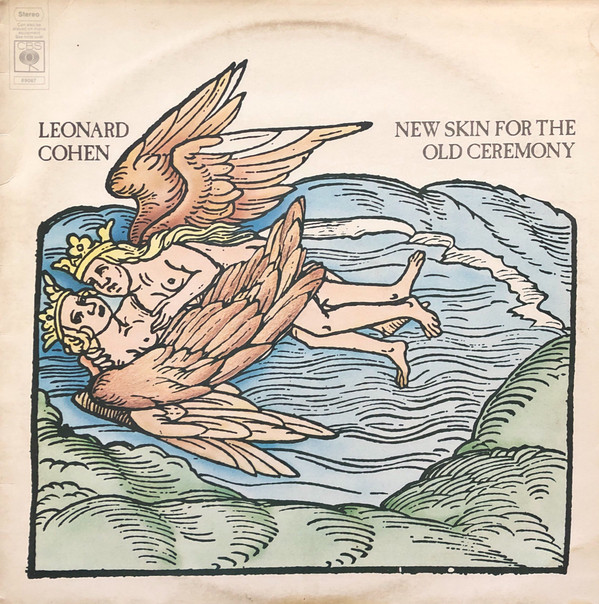

# New Skin For The Old Ceremony

By Leonard Cohen

## Album Data

- Catalog #: 88697961772-4
- Label: Columbia
- Format: CD
- Tracks: 11
- Released: 
- Discs: 1
- Box Set: 
- Length: 37:23
- Genre: "Folk, allgemein" | Adult Contemporary | Canadian | Folk Rock | Folk-Rock | Rock | Singer/Songwriter
- Songwriter: 
- Producer: 
- Musician: 

## See also

- [Dear Heather](Dear_Heather.md)
- [Death A Of Ladies' Man](Death_A_Of_Ladies_Man.md)
- [I'm Your Man](Im_Your_Man.md)
- [Recent Songs](Recent_Songs.md)
- [Songs From A Room](Songs_From_A_Room.md)
- [Songs Of Leonard Cohen](Songs_Of_Leonard_Cohen.md)
- [Songs Of Love And Hate](Songs_Of_Love_And_Hate.md)
- [Ten New Songs](Ten_New_Songs.md)
- [The Future](The_Future.md)
- [Various Positions](Various_Positions.md)
