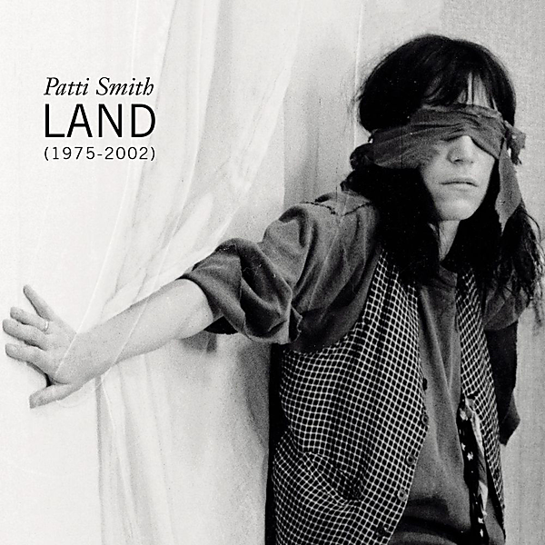

# Land ( 1975-2002 ) (Disc 1)

By Patti Smith

## Album Data

- Catalog #: 07822 14708-2
- Label: Arista Records, Inc. / BMG Entertainment
- Format: CD
- Tracks: 17
- Released: 
- Discs: 1
- Box Set: 
- Length: 1:11:39
- Genre: 2000s | 70s | 80s | 90s | Alternative | Female Singer | Indie | Punk | Rock | Singer / Songwriter
- Songwriter: 
- Producer: 
- Musician: 

## See also

- [Land ( 1975-2002 ) (Disc 2)](Land__1975-2002__Disc_2.md)
