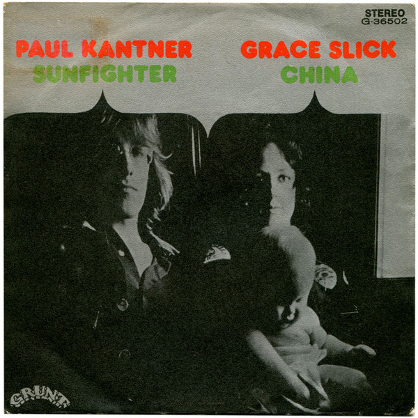

# Sunfighter

By Paul Kantner & Grace Slick

## Album Data

- Catalog #: 
- Label: 
- Format: CD
- Tracks: 12
- Released: 
- Discs: 1
- Box Set: 
- Length: 41:55
- Genre: Progressive Rock | Psychedelic Rock
- Songwriter: 
- Producer: 
- Musician: 

## See also

- [Baron Von Tollbooth & The Chrome Nun](Baron_Von_Tollbooth_and_The_Chrome_Nun.md)
- [After Bathing At Baxter's](../Jefferson_Airplane/After_Bathing_At_Baxters.md)
- [Bark](../Jefferson_Airplane/Bark.md)
- [Early Flight Thirty Seconds Over Winterland](../Jefferson_Airplane/Early_Flight_Thirty_Seconds_Over_Winterland.md)
- [Long John Silver](../Jefferson_Airplane/Long_John_Silver.md)
- [Original Album Classics (Disc 1)](../Jefferson_Airplane/Original_Album_Classics_Disc_1.md)
- [Dreams](../Grace_Slick/Dreams.md)
- [Manhole](../Grace_Slick/Manhole.md)
- [Welcome To The Wrecking Ball! / Software](../Grace_Slick/Welcome_To_The_Wrecking_Ball!-Software_Two_Lps_On_One_Cd.md)
