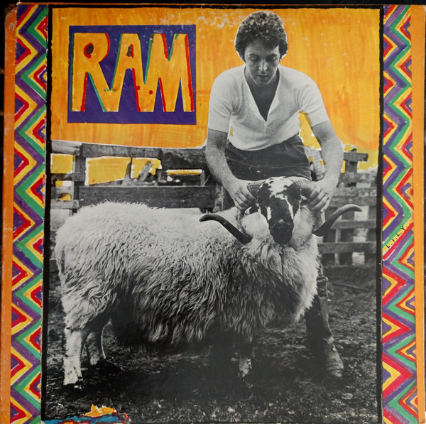

# Ram

By Paul & Linda McCartney

## Album Data

- Catalog #: CDP 7 46612 2
- Label: Capitol Records
- Format: CD
- Tracks: 12
- Released: 
- Discs: 1
- Box Set: 
- Length: 43:13
- Genre: Off Solo | Pop | Rock | Rock - Classic
- Songwriter: 
- Producer: 
- Musician: 

## See also

- [Mccartney](Mccartney.md)
- [Beets: All the Best](../../Beets/Paul_McCartney/All_the_Best.md)
- [Beets: McCartney](../../Beets/Paul_McCartney/McCartney.md)
- [Beets: Memory Almost Full](../../Beets/Paul_McCartney/Memory_Almost_Full.md)
- [Beets: New](../../Beets/Paul_McCartney/New.md)
- [Beets: Pure McCartney](../../Beets/Paul_McCartney/Pure_McCartney.md)
- [Beets: RAM](../../Beets/Paul_McCartney/RAM_2.md)
- [Beets: RAM](../../Beets/Paul_McCartney/RAM.md)
- [Roon: Band On The Run](../../Roon/Paul_McCartney/Band_On_The_Run.md)
- [Roon: McCartney (Archive Collection)](../../Roon/Paul_McCartney/McCartney_Archive_Collection.md)
- [Roon: NEW (Deluxe Edition)](../../Roon/Paul_McCartney/NEW_Deluxe_Edition.md)
- [Roon: Pure McCartney](../../Roon/Paul_McCartney/Pure_McCartney.md)
- [Roon: Ram (Archive Collection)](../../Roon/Paul_McCartney/Ram_Archive_Collection.md)
- [Roon: Wings At The Speed Of Sound (Archive Collection)](../../Roon/Paul_McCartney/Wings_At_The_Speed_Of_Sound_Archive_Collection.md)
- [Roon: Wings Over America (Live / Remastered)](../../Roon/Paul_McCartney/Wings_Over_America_Live_-_Remastered.md)
- [Roon: Wingspan](../../Roon/Paul_McCartney/Wingspan.md)
- [Vinyl: McCartney](../../Vinyl/Paul_McCartney/McCartney.md)
- [Vinyl: ](../../Vinyl/Paul_McCartney/Paul_McCartney.md)
- [Vinyl: Press To Play](../../Vinyl/Paul_McCartney/Press_To_Play.md)
