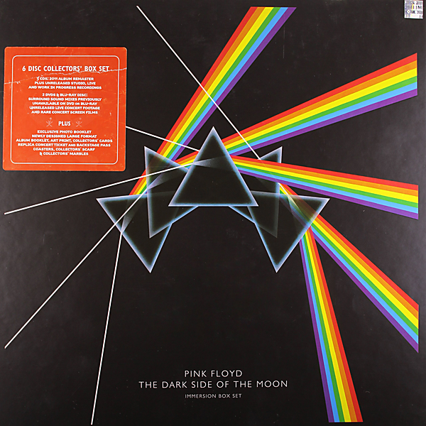

# The Dark Side Of The Moon - Immersion Box Set (Disc 1)

By Pink Floyd

## Album Data

- Catalog #: 5 0999 029431 2 1
- Label: EMI
- Format: CD
- Tracks: 10
- Released: 
- Discs: 1
- Box Set: 
- Length: 42:54
- Genre: Classic Rock | Pop | Progressive Rock | Psychedelic | Rock
- Songwriter: 
- Producer: 
- Musician: 

## See also

- [Animals [2011 Remaster]](Animals_[2011_Remaster].md)
- [A Saucerful Of Secrets](A_Saucerful_Of_Secrets.md)
- [Meddle](Meddle.md)
- [The Division Bell](The_Division_Bell.md)
- [The Wall (Disc 1)](The_Wall_Disc_1.md)
- [The Wall (Disc 2)](The_Wall_Disc_2.md)
- [Wish You Were Here](Wish_You_Were_Here.md)
