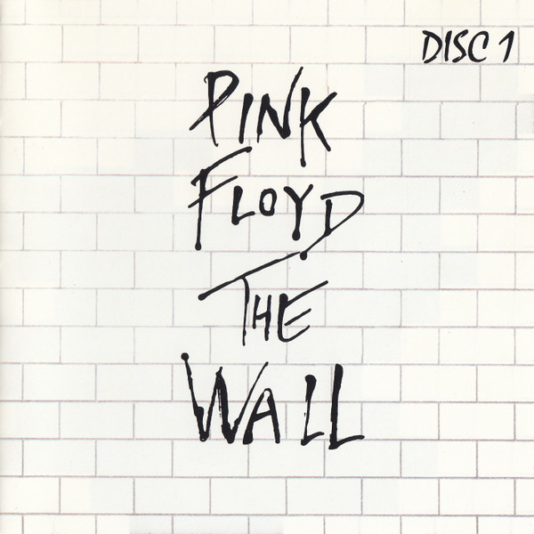

# The Wall (Disc 2)

By Pink Floyd

## Album Data

- Catalog #: 50999 028944 2 3
- Label: Parlophone Records Ltd.
- Format: CD
- Tracks: 13
- Released: 
- Discs: 1
- Box Set: 
- Length: 41:50
- Genre: Arena Rock | Art Rock | Classic Rock | Prog Rock | Progressive Rock | Psychedelic | Psychedelic Rock | Rock | Rock - Classic
- Songwriter: 
- Producer: 
- Musician: 

## See also

- [Animals [2011 Remaster]](Animals_[2011_Remaster].md)
- [A Saucerful Of Secrets](A_Saucerful_Of_Secrets.md)
- [Meddle](Meddle.md)
- [The Dark Side Of The Moon - Immersion Box Set (Disc 1)](The_Dark_Side_Of_The_Moon_-_Immersion_Box_Set_Disc_1.md)
- [The Division Bell](The_Division_Bell.md)
- [The Wall (Disc 1)](The_Wall_Disc_1.md)
- [Wish You Were Here](Wish_You_Were_Here.md)
