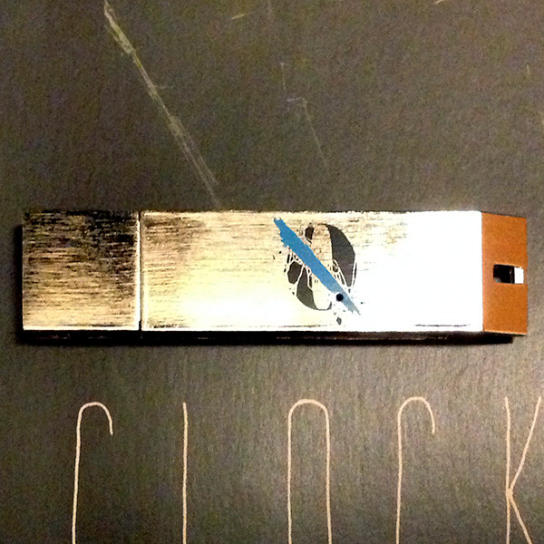

# ...Like Clockwork

By Queens of the Stone Age

## Album Data

- Catalog #: OLE-1040-2
- Label: Matador Records
- Format: CD
- Tracks: 10
- Released: 
- Discs: 1
- Box Set: 
- Length: 46:03
- Genre: Alternative Rock | Alternative/Indie/Grunge | Art Rock | Desert Rock | Hard Rock | Metal | Pop/Rock | Stoner Metal | Stoner Rock
- Songwriter: 
- Producer: 
- Musician: 

## See also

- 
- [Roon: Era Vulgaris](../../Roon/Queens_of_the_Stone_Age/Era_Vulgaris.md)
- [Roon: ...Like Clockwork (Queens Of The Stone Age)](../../Roon/Queens_of_the_Stone_Age/Like_Clockwork_Queens_Of_The_Stone_Age.md)
- [Roon: Lullabies To Paralyze](../../Roon/Queens_of_the_Stone_Age/Lullabies_To_Paralyze.md)
- [Roon: Queens of the Stone Age](../../Roon/Queens_of_the_Stone_Age/Queens_of_the_Stone_Age.md)
- [Roon: Rated R - Deluxe Edition](../../Roon/Queens_of_the_Stone_Age/Rated_R_-_Deluxe_Edition.md)
- [Roon: Songs For The Deaf](../../Roon/Queens_of_the_Stone_Age/Songs_For_The_Deaf.md)
- [Roon: Villains](../../Roon/Queens_of_the_Stone_Age/Villains.md)
