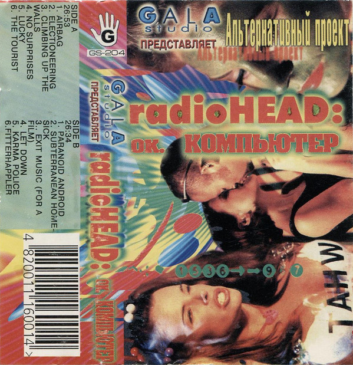

# Ok Computer

By Radiohead

## Album Data

- Catalog #: 7243 8 55229 2 5
- Label: EMI/Parlophone
- Format: CD
- Tracks: 12
- Released: 
- Discs: 1
- Box Set: 
- Length: 53:21
- Genre: Alternative | Alternative - Rock | Alternative Rock | Brit Pop | Pop | Pop/Rock | Rock
- Songwriter: 
- Producer: 
- Musician: 

## See also

- 
- [Beets: Hail To the Thief](../../Beets/Radiohead/Hail_To_the_Thief.md)
- [Beets: In Rainbows](../../Beets/Radiohead/In_Rainbows.md)
- [Beets: Kid A](../../Beets/Radiohead/Kid_A.md)
- [Beets: OK Computer](../../Beets/Radiohead/OK_Computer.md)
- [Beets: Pablo Honey](../../Beets/Radiohead/Pablo_Honey.md)
- [Beets: The Bends](../../Beets/Radiohead/The_Bends.md)
- [Roon: Amnesiac](../../Roon/Radiohead/Amnesiac.md)
- [Roon: A Moon Shaped Pool (Radiohead)](../../Roon/Radiohead/A_Moon_Shaped_Pool_Radiohead.md)
- [Roon: Creep](../../Roon/Radiohead/Creep.md)
- [Roon: Hail to the Thief](../../Roon/Radiohead/Hail_to_the_Thief.md)
- [Roon: Karma Police](../../Roon/Radiohead/Karma_Police.md)
- [Roon: Kid A](../../Roon/Radiohead/Kid_A.md)
- [Roon: No Surprises](../../Roon/Radiohead/No_Surprises.md)
- [Roon: OK Computer OKNOTOK 1997 2017](../../Roon/Radiohead/OK_Computer_OKNOTOK_1997_2017.md)
- [Roon: Pablo Honey](../../Roon/Radiohead/Pablo_Honey.md)
- [Roon: Paranoid Android](../../Roon/Radiohead/Paranoid_Android.md)
- [Roon: The Bends](../../Roon/Radiohead/The_Bends.md)
- [Roon: The King Of Limbs](../../Roon/Radiohead/The_King_Of_Limbs.md)
- [Vinyl: OK Computer](../../Vinyl/Radiohead/OK_Computer.md)
- [Vinyl: ](../../Vinyl/Radiohead/Radiohead.md)
