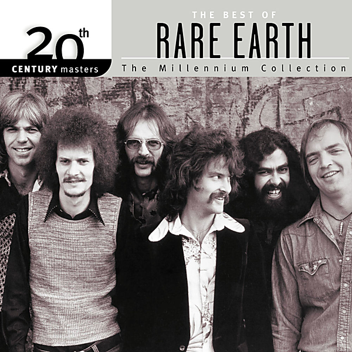

# 20th Century Masters: The Millennium Collection: The Best Of Rare Earth

By Rare Earth

## Album Data

- Catalog #: 012 159 603-2
- Label: Motown Records
- Format: CD
- Tracks: 7
- Released: 
- Discs: 1
- Box Set: 
- Length: 1:08:59
- Genre: Classic Rock | Rhythm & Blues
- Songwriter: 
- Producer: 
- Musician: 

## See also

- 
- [Beets: 20th Century Masters](../../Beets/Rare_Earth/20th_Century_Masters.md)
- [Beets: Ecology](../../Beets/Rare_Earth/Ecology.md)
- [Beets: Get Ready](../../Beets/Rare_Earth/Get_Ready.md)
- [Roon: Dreams/Answers](../../Roon/Rare_Earth/Dreams-Answers.md)
- [Roon: Ecology](../../Roon/Rare_Earth/Ecology.md)
- [Roon: Get Ready](../../Roon/Rare_Earth/Get_Ready.md)
- [Roon: In Concert (Live In Concert, US/1971)](../../Roon/Rare_Earth/In_Concert_Live_In_Concert__US-1971.md)
- [Vinyl: Get Ready](../../Vinyl/Rare_Earth/Get_Ready.md)
- [Vinyl: ](../../Vinyl/Rare_Earth/Rare_Earth.md)
