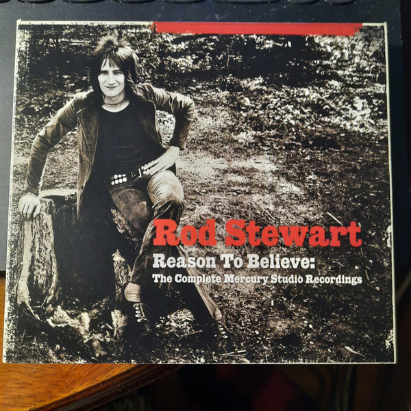

# Reason To Believe: The Complete Mercury Studio Recordings (Disc 2)

By Rod Stewart

## Album Data

- Catalog #: 
- Label: Mercury
- Format: CD
- Tracks: 18
- Released: 
- Discs: 1
- Box Set: 
- Length: 1:17:00
- Genre: 
- Songwriter: 
- Producer: 
- Musician: 

## See also

- [Reason To Believe](Reason_To_Believe-_The_Complete_Mercury_Studio_Recordings_Disc_1.md)
- [Reason To Believe](Reason_To_Believe-_The_Complete_Mercury_Studio_Recordings_Disc_3.md)
- [Beets: Every Picture Tells a Story](../../Beets/Rod_Stewart/Every_Picture_Tells_a_Story.md)
- [Beets: Reason To Believe](../../Beets/Rod_Stewart/Reason_To_Believe_2_3.md)
- [Beets: Reason To Believe](../../Beets/Rod_Stewart/Reason_To_Believe_2.md)
- [Beets: Reason To Believe](../../Beets/Rod_Stewart/Reason_To_Believe.md)
- [Roon: Every Picture Tells A Story](../../Roon/Rod_Stewart/Every_Picture_Tells_A_Story.md)
- [Roon: Reason To Believe](../../Roon/Rod_Stewart/Reason_To_Believe-_The_Complete_Mercury_Recordings.md)
- [Vinyl: Every Picture Tells A Story](../../Vinyl/Rod_Stewart/Every_Picture_Tells_A_Story.md)
- [Vinyl: Gasoline Alley](../../Vinyl/Rod_Stewart/Gasoline_Alley.md)
- [Vinyl: ](../../Vinyl/Rod_Stewart/Rod_Stewart.md)
