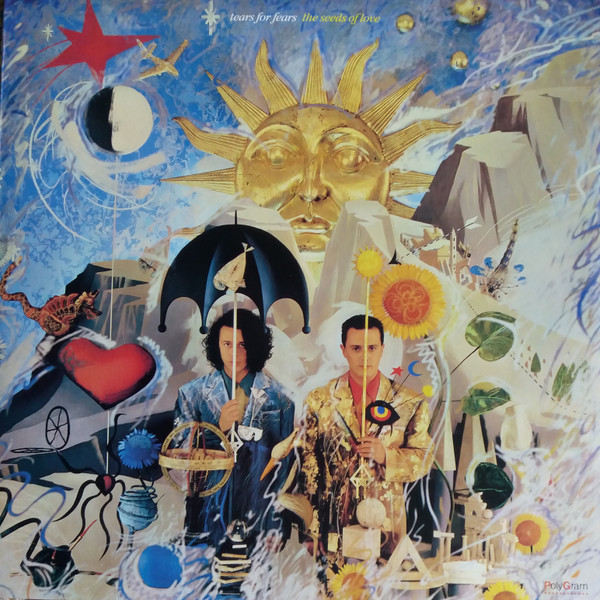

# The Seeds Of Love

By Tears for Fears

## Album Data

- Catalog #: 838 730-2
- Label: PolyGram Records
- Format: CD
- Tracks: 8
- Released: 
- Discs: 1
- Box Set: 
- Length: 49:35
- Genre: Alternative Pop/Rock | Electronic | Pop / Rock | Rock | Synthpop
- Songwriter: 
- Producer: 
- Musician: 

## See also

- [The Hurting (Expanded Edition) (1999)](The_Hurting_Expanded_Edition_1999.md)
