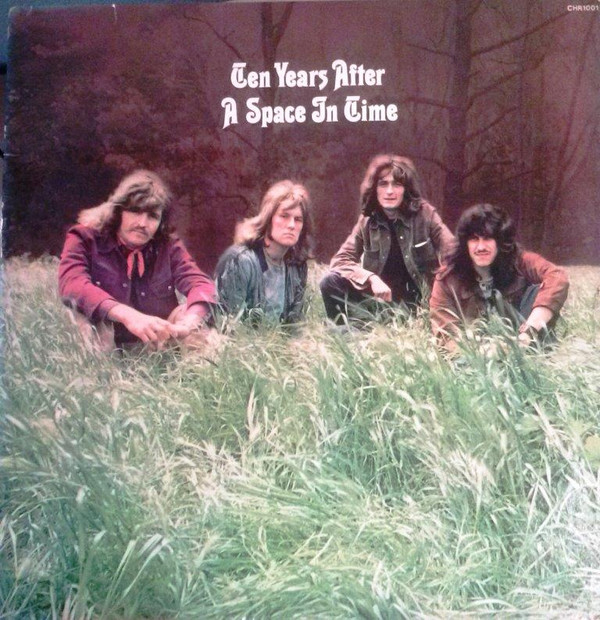

# A Space In Time

By Ten Years After

## Album Data

- Catalog #: F2 21001
- Label: Chrysalis Records, Inc.
- Format: CD
- Tracks: 10
- Released: 
- Discs: 1
- Box Set: 
- Length: 37:26
- Genre: Blues Rock | Hard Rock | Psychedelic Rock | Rock
- Songwriter: 
- Producer: 
- Musician: 

## See also

- 
- [Beets: A Space in Time](../../Beets/Ten_Years_After/A_Space_in_Time.md)
- [Beets: Cricklewood Green](../../Beets/Ten_Years_After/Cricklewood_Green.md)
- [Beets: Rock & Roll Music to the World](../../Beets/Ten_Years_After/Rock_and_Roll_Music_to_the_World.md)
- [Beets: Stonedhenge](../../Beets/Ten_Years_After/Stonedhenge.md)
- [Beets: Undead](../../Beets/Ten_Years_After/Undead.md)
- [Roon: A Space in Time (Deluxe Version)](../../Roon/Ten_Years_After/A_Space_in_Time_Deluxe_Version.md)
- [Roon: Cricklewood Green (2017 Remaster)](../../Roon/Ten_Years_After/Cricklewood_Green_2017_Remaster.md)
- [Roon: Rock & Roll Music to the World (2017 Remaster)](../../Roon/Ten_Years_After/Rock_and_Roll_Music_to_the_World_2017_Remaster.md)
- [Roon: Ten Years After (Re-Presents)](../../Roon/Ten_Years_After/Ten_Years_After_Re-Presents.md)
- [Roon: Undead (Re-Presents / Live)](../../Roon/Ten_Years_After/Undead_Re-Presents_-_Live.md)
- [Vinyl: Rock & Roll Music To The World](../../Vinyl/Ten_Years_After/Rock_and_Roll_Music_To_The_World.md)
- [Vinyl: ](../../Vinyl/Ten_Years_After/Ten_Years_After.md)
