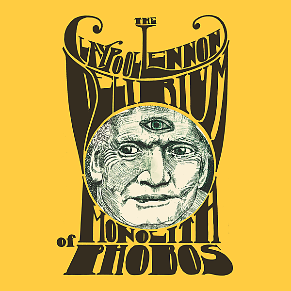

# The Monolith of Phobos

By The Claypool Lennon Delirium

## Album Data

- Catalog #: ATO0308
- Label: ATO Records/Prawn Song Records/Chimera Records
- Format: CD
- Tracks: 11
- Released: 
- Discs: 1
- Box Set: 
- Length: 50:12
- Genre: Alt. Pop/Rock, Singer/Songwriter
- Songwriter: 
- Producer: 
- Musician: 

## See also

- [Friendly Fire](../Sean_Lennon/Friendly_Fire.md)
- [Into The Sun](../Sean_Lennon/Into_The_Sun.md)
- [Rosencrantz And Guildenstern Are Undead](../Sean_Lennon/Rosencrautz_And_Guildenstern_Are_Undead.md)
- [Acoustic Sessions](../The_Ghost_Of_A_Saber_Tooth_Tiger/Acoustic_Sessions.md)
