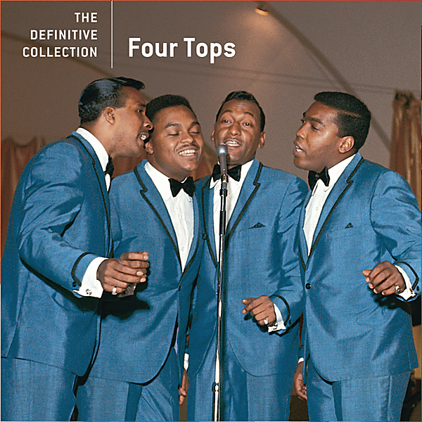

# The Definitive Collection - The Four Tops

By The Four Tops

## Album Data

- Catalog #: B0011733-02
- Label: Motown Records / Unversal Music & Video Distribution, Corp.
- Format: CD
- Tracks: 18
- Released: 
- Discs: 1
- Box Set: 
- Length: 51:23
- Genre: motown | Motown/Oldies Pop/Rock/Original Artists/Original Songs | Oldies | Oldies/Pop/Rock/AM Pop/Male Harmony Group/Adult Contemporary/Baroque Pop/Soul Pop | R & B | R&B | R&B SOUL | R&B Vocal | Soul
- Songwriter: 
- Producer: 
- Musician: 

