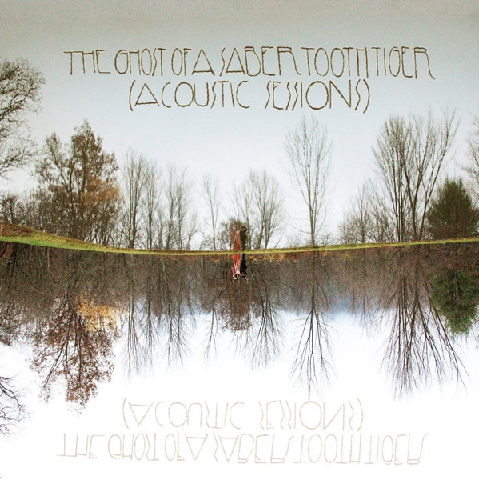

# Acoustic Sessions

By The Ghost Of A Saber Tooth Tiger

## Album Data

- Catalog #: 1205
- Label: Chimera Music
- Format: CD
- Tracks: 9
- Released: 
- Discs: 1
- Box Set: 
- Length: 35:42
- Genre: Indie Pop | Rock
- Songwriter: 
- Producer: 
- Musician: 

## See also

- [Friendly Fire](../Sean_Lennon/Friendly_Fire.md)
- [Into The Sun](../Sean_Lennon/Into_The_Sun.md)
- [Rosencrantz And Guildenstern Are Undead](../Sean_Lennon/Rosencrautz_And_Guildenstern_Are_Undead.md)
- [The Monolith of Phobos](../The_Claypool_Lennon_Delirium/The_Monolith_of_Phobos.md)
