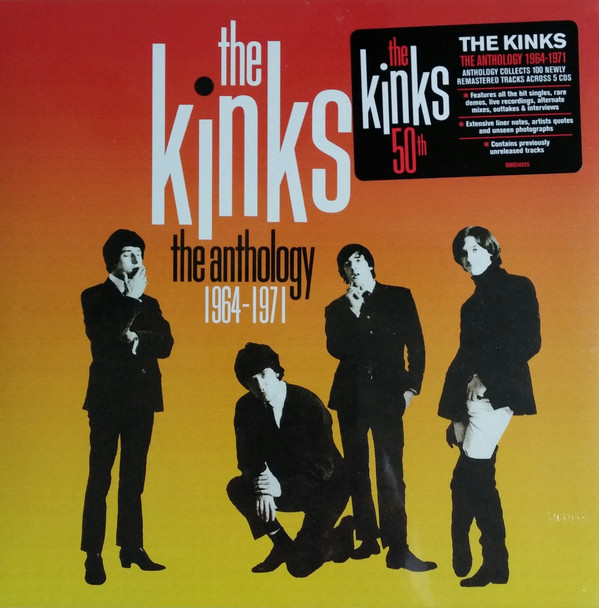

# The Anthology 1964 - 1971 (Disc 1)

By The Kinks

## Album Data

- Catalog #: 
- Label: BMG
- Format: CD
- Tracks: 33
- Released: 
- Discs: 1
- Box Set: 
- Length: 1:14:06
- Genre: *Rock | 60's | British Invasion
- Songwriter: 
- Producer: 
- Musician: 

## See also

- [Lola Versus Powerman And The Money-Go-Round (Part One)](Lola_Versus_Powerman_And_The_Money-Go-Round_Part_One.md)
- [Muswell Hillbillies](Muswell_Hillbillies.md)
- [The Anthology 1964 - 1971 (Disc 2)](The_Anthology_1964_-_1971_Disc_2.md)
- [The Anthology 1964 - 1971 (Disc 3)](The_Anthology_1964_-_1971_Disc_3.md)
- [The Anthology 1964 - 1971 (Disc 4)](The_Anthology_1964_-_1971_Disc_4.md)
- [The Anthology 1964 - 1971 (Disc 5)](The_Anthology_1964_-_1971_Disc_5.md)
