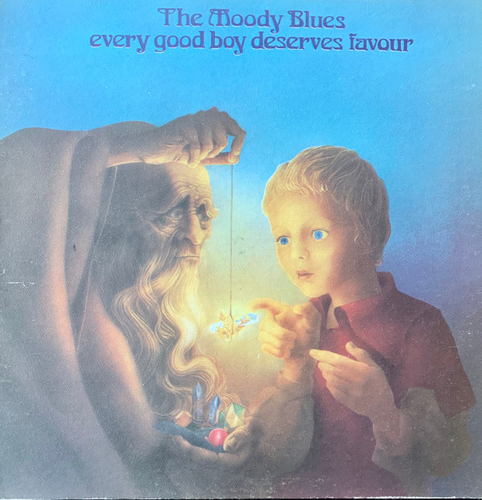

# Every Good Boy Deserves Favour

By The Moody Blues

## Album Data

- Catalog #: 984 550-6
- Label: Threshold (Universal Music, Japan)
- Format: CD
- Tracks: 11
- Released: 
- Discs: 1
- Box Set: 
- Length: 47:27
- Genre: Classic Rock | Pop/Rock | Progressive Rock | Psychedelic Rock | Rock | Symphonic Rock
- Songwriter: 
- Producer: 
- Musician: 

## See also

- [A Question Of Balance](A_Question_Of_Balance.md)
- [Days Of Future Passed](Days_Of_Future_Passed.md)
- [In Search Of The Lost Chord](In_Search_Of_The_Lost_Chord.md)
- [Long Distance Voyager](Long_Distance_Voyager.md)
- [On The Threshold Of A Dream](On_The_Threshold_Of_A_Dream.md)
- [Time Traveller (Disc 1)](Time_Traveller_Disc_1.md)
- [Time Traveller (Disc 2)](Time_Traveller_Disc_2.md)
- [Time Traveller (Disc 3)](Time_Traveller_Disc_3.md)
- [Time Traveller (Disc 4)](Time_Traveller_Disc_4.md)
- [To Our Children's Children's Children](To_Our_Childrens_Childrens_Children.md)
