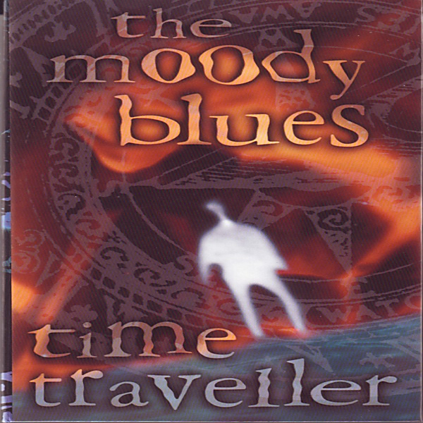

# Time Traveller (Disc 3)

By The Moody Blues

## Album Data

- Catalog #: 31451 6436 2
- Label: Polydor / Threshold Records / Chronicles / Polygram Records, Inc.
- Format: CD
- Tracks: 16
- Released: 
- Discs: 1
- Box Set: 
- Length: 1:19:05
- Genre: 60s | 70s | 80s | 90s | British Rock | Classic Rock | Live Tracks | Progressive Rock | psychedelia
- Songwriter: 
- Producer: 
- Musician: 

## See also

- [A Question Of Balance](A_Question_Of_Balance.md)
- [Days Of Future Passed](Days_Of_Future_Passed.md)
- [Every Good Boy Deserves Favour](Every_Good_Boy_Deserves_Favour.md)
- [In Search Of The Lost Chord](In_Search_Of_The_Lost_Chord.md)
- [Long Distance Voyager](Long_Distance_Voyager.md)
- [On The Threshold Of A Dream](On_The_Threshold_Of_A_Dream.md)
- [Time Traveller (Disc 1)](Time_Traveller_Disc_1.md)
- [Time Traveller (Disc 2)](Time_Traveller_Disc_2.md)
- [Time Traveller (Disc 4)](Time_Traveller_Disc_4.md)
- [To Our Children's Children's Children](To_Our_Childrens_Childrens_Children.md)
- [Beets: A Question of Balance](../../Beets/The_Moody_Blues/A_Question_of_Balance.md)
- [Beets: Days Of Future Passed](../../Beets/The_Moody_Blues/Days_Of_Future_Passed.md)
- [Beets: Every Good Boy Deserves Favour](../../Beets/The_Moody_Blues/Every_Good_Boy_Deserves_Favour.md)
- [Beets: In Search of the Lost Chord](../../Beets/The_Moody_Blues/In_Search_of_the_Lost_Chord.md)
- [Beets: In Search Of The Lost Chord](../../Beets/The_Moody_Blues/In_Search_Of_The_Lost_Chord.md)
- [Beets: Long Distance Voyager](../../Beets/The_Moody_Blues/Long_Distance_Voyager.md)
- [Beets: Lovely to See You Disc 2](../../Beets/The_Moody_Blues/Lovely_to_See_You_Disc_2.md)
- [Beets: On the Threshold of a Dream](../../Beets/The_Moody_Blues/On_the_Threshold_of_a_Dream.md)
- [Beets: Seventh Sojourn](../../Beets/The_Moody_Blues/Seventh_Sojourn.md)
- [Beets: Time Traveller Disc 1](../../Beets/The_Moody_Blues/Time_Traveller_Disc_1.md)
- [Beets: Time Traveller Disc 2](../../Beets/The_Moody_Blues/Time_Traveller_Disc_2.md)
- [Beets: Time Traveller Disc 3](../../Beets/The_Moody_Blues/Time_Traveller_Disc_3.md)
- [Beets: Time Traveller Disc 4](../../Beets/The_Moody_Blues/Time_Traveller_Disc_4.md)
- [Beets: To Our Children's Children's Children](../../Beets/The_Moody_Blues/To_Our_Childrens_Childrens_Children.md)
- [Beets: Unknown Album (7/19/2005 9](../../Beets/The_Moody_Blues/Unknown_Album_7-19-2005_9.md)
- [Roon: A Question Of Balance](../../Roon/The_Moody_Blues/A_Question_Of_Balance.md)
- [Roon: Days Of Future Passed (Deluxe Version)](../../Roon/The_Moody_Blues/Days_Of_Future_Passed_Deluxe_Version.md)
- [Roon: Every Good Boy Deserves Favour](../../Roon/The_Moody_Blues/Every_Good_Boy_Deserves_Favour.md)
- [Roon: In Search Of The Lost Chord (50th Anniversary Deluxe Edition) (50th Anniversary Edition / Deluxe)](../../Roon/The_Moody_Blues/In_Search_Of_The_Lost_Chord_50th_Anniversary_Deluxe_Edition_50th_Anniversary_Edition_-_Deluxe.md)
- [Roon: Long Distance Voyager (Expanded)](../../Roon/The_Moody_Blues/Long_Distance_Voyager_Expanded.md)
- [Roon: On The Threshold Of A Dream](../../Roon/The_Moody_Blues/On_The_Threshold_Of_A_Dream.md)
- [Roon: Seventh Sojourn](../../Roon/The_Moody_Blues/Seventh_Sojourn.md)
- [Roon: The Other Side Of Life](../../Roon/The_Moody_Blues/The_Other_Side_Of_Life.md)
- [Roon: The Present](../../Roon/The_Moody_Blues/The_Present.md)
- [Roon: This Is The Moody Blues](../../Roon/The_Moody_Blues/This_Is_The_Moody_Blues.md)
- [Roon: To Our Children's Children's Children](../../Roon/The_Moody_Blues/To_Our_Childrens_Childrens_Children.md)
- [Vinyl: A Question Of Balance](../../Vinyl/The_Moody_Blues/A_Question_Of_Balance.md)
- [Vinyl: In Search Of The Lost Chord](../../Vinyl/The_Moody_Blues/In_Search_Of_The_Lost_Chord.md)
- [Vinyl: On The Threshold Of A Dream](../../Vinyl/The_Moody_Blues/On_The_Threshold_Of_A_Dream.md)
- [Vinyl: Seventh Sojourn](../../Vinyl/The_Moody_Blues/Seventh_Sojourn.md)
- [Vinyl: ](../../Vinyl/The_Moody_Blues/The_Moody_Blues.md)
