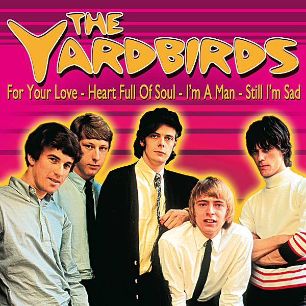

# "Greatest Hits, Volume One (1964-1966)"

By The Yardbirds

## Album Data

- Catalog #: RNCD 75895
- Label: Rhino
- Format: CD
- Tracks: 18
- Released: 
- Discs: 1
- Box Set: 
- Length: 52:47
- Genre: 1960's | British Invasion | compilation | General Rock | Rock
- Songwriter: 
- Producer: 
- Musician: 

