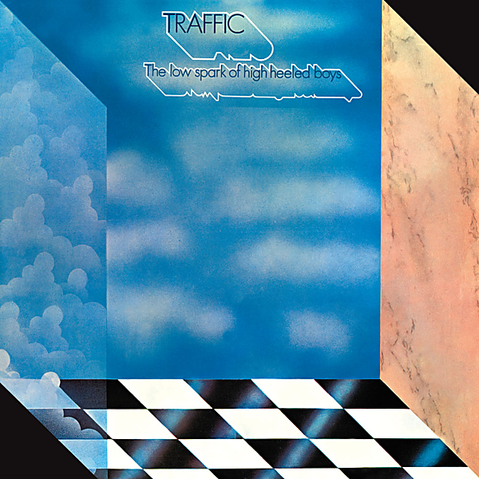

# The Low Spark Of High-Heeled Boys

By Traffic

## Album Data

- Catalog #: 314 548 827-2
- Label: Island
- Format: CD
- Tracks: 7
- Released: 
- Discs: 1
- Box Set: 
- Length: 46:32
- Genre: Progressive Rock | Rock
- Songwriter: 
- Producer: 
- Musician: 

## See also

- 
- [Beets: John Barleycorn Must Die](../../Beets/Traffic/John_Barleycorn_Must_Die.md)
- [Beets: The Low Spark of High Heeled Boys](../../Beets/Traffic/The_Low_Spark_of_High_Heeled_Boys.md)
- [Beets: Traffic](../../Beets/Traffic/Traffic.md)
- [Roon: John Barleycorn Must Die](../../Roon/Traffic/John_Barleycorn_Must_Die.md)
- [Roon: Last Exit](../../Roon/Traffic/Last_Exit.md)
- [Roon: Mr. Fantasy](../../Roon/Traffic/Mr_Fantasy.md)
- [Roon: The Low Spark Of High Heeled Boys](../../Roon/Traffic/The_Low_Spark_Of_High_Heeled_Boys.md)
- [Roon: Traffic](../../Roon/Traffic/Traffic.md)
- [Roon: Welcome To The Canteen](../../Roon/Traffic/Welcome_To_The_Canteen.md)
- [Roon: When The Eagle Flies](../../Roon/Traffic/When_The_Eagle_Flies.md)
- [Vinyl: John Barleycorn Must Die](../../Vinyl/Traffic/John_Barleycorn_Must_Die.md)
- [Vinyl: ](../../Vinyl/Traffic/Traffic.md)
