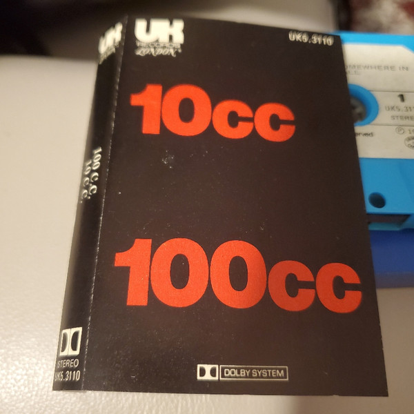

# 10cc

By 10cc

## Album Data

[Discogs URL](https://www.discogs.com/release/3099525-10cc-10cc)

- Label: UK Records
- Formats: Vinyl, LP, Album, Stereo
- Genres: Rock, Art Rock, Pop Rock
- Rating: 3.82
- Released: 1973
- Year: 1973
- Release ID: 3099525
- Media condition: 
- Sleeve condition: 
- Speed: 
- Weight: 
- Notes: 

## Album Tracks

| **Position** | **Title** | **Duration** |
|--------------|-----------|--------------|
| A1 | **Johnny, Don't Do It** | 3:37 |
| A2 | **Sand In My Face** | 3:37 |
| A3 | **Donna** | 2:54 |
| A4 | **The Dean And I** | 3:03 |
| A5 | **Headline Hustler** | 3:30 |
| B1 | **Speed Kills** | 3:48 |
| B2 | **Rubber Bullets** | 5:18 |
| B3 | **The Hospital Song** | 2:36 |
| B4 | **Ships Don't Disappear In The Night (Do They?)** | 3:03 |
| B5 | **Fresh Air For My Momma** | 3:02 |

## Artist Roles

| **Name** | **Role** |
|----------|----------|
| **Lol Creme** | Acoustic Guitar, Electric Guitar, Grand Piano, Electric Piano, Synthesizer [Moog], Mellotron, Percussion, Vocals |
| **David Anstey** | Artwork |
| **Graham Gouldman** | Bass Guitar, Acoustic Guitar, Dobro [Dobro Guitar], Electric Guitar, Tambourine, Vocals |
| **10cc** | Composed By |
| **Lol Creme** | Design |
| **Kevin Godley** | Drums, Percussion, Vocals |
| **Eric Stewart** | Engineer |
| **Eric Stewart** | Engineer [Mix Sound] |
| **Eric Stewart** | Lead Guitar [Electric], Slide Guitar, Synthesizer [Moog], Vocals |
| **Chris Grayson (3)** | Photography By |
| **10cc** | Producer |

