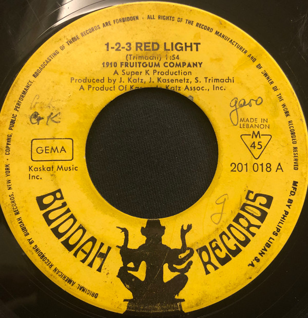

# 1, 2, 3, Red Light

By 1910 Fruitgum Company

## Album Data

[Discogs URL](https://www.discogs.com/release/1321608-1910-Fruitgum-Company-1-2-3-Red-Light)

- Label: Buddah Records
- Formats: Vinyl, 7", 45 RPM, Single
- Genres: Rock, Pop, Bubblegum
- Rating: 3.62
- Released: 1968
- Year: 1968
- Release ID: 1321608
- Media condition: 
- Sleeve condition: 
- Speed: 
- Weight: 
- Notes: 

## Album Tracks

| **Position** | **Title** | **Duration** |
|--------------|-----------|--------------|
| A | **1, 2, 3, Red Light** | 1:54 |
| B | **Sticky, Sticky** | 2:05 |

## Artist Roles

| **Name** | **Role** |
|----------|----------|
| **Jeff Katz** | Producer |
| **Jerry Kasenetz** | Producer |
| **Sal Trimachi** | Producer |

