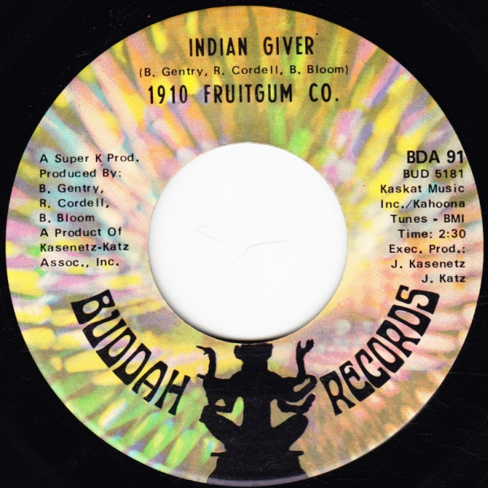

# Indian Giver

By 1910 Fruitgum Company

## Album Data

[Discogs URL](https://www.discogs.com/release/4932188-1910-Fruitgum-Co-Indian-Giver)

- Label: Buddah Records
- Formats: Vinyl, 7", 45 RPM
- Genres: Rock, Pop, Pop Rock, Bubblegum
- Rating: 3.25
- Released: 1969
- Year: 1969
- Release ID: 4932188
- Media condition: 
- Sleeve condition: 
- Speed: 
- Weight: 
- Notes: 

## Album Tracks

| **Position** | **Title** | **Duration** |
|--------------|-----------|--------------|
| A | **Indian Giver** | 2:30 |
| B | **Pow Wow** | 2:00 |

