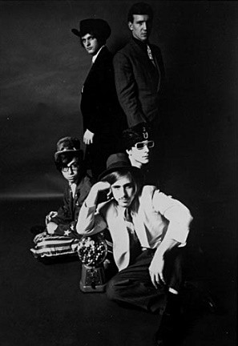

# 1910 Fruitgum Company

## Artist Profile

The 1910 Fruitgum Company is an American bubblegum pop band of the 1960s. The group's Billboard Hot 100 hits were "Simon Says", "May I Take a Giant Step", "1, 2, 3, Red Light", "Goody Goody Gumdrops", "Indian Giver", "Special Delivery", and "The Train"

The band began as Jeckell and The Hydes in New Jersey in 1966. The original members were Frank Jeckell, Mark Gutkowski, Floyd Marcus, Pat Karwan and Steve Mortkowitz - all from Linden, New Jersey.

During 1967, they were signed to Buddah Records, where they released five LPs under their own name and a variety of singles, as well as appearing on the LP The Kasenetz-Katz Singing Orchestral Circus, which sounded like the usual Buddah studio band in spite of its promotion as a "bubblegum superjam". Their first hit single, "Simon Says", was written by Elliot Chiprut. During the recording process, the band changed the beat and patterned the song after "Wooly Bully" by Sam the Sham and the Pharaohs. "Simon Says" soon became a success, hitting #4 on the US Billboard Hot 100 chart. The track peaked at #2 on the UK Singles Chart[ and was heard in the 1968 Frederick Wiseman documentary High School.[citation needed]

The original five members of the 1910 Fruitgum Company circa 1966; photo taken at the home of Floyd Marcus. Shown on top from the left are Floyd and Steve. On the bottom are Pat, Frank and Mark.
The band started touring, opening for major acts such as The Beach Boys. They went on to release the hits "Simon Says", "May I Take a Giant Step", "1, 2, 3, Red Light" (U.S. #5), "Special Delivery" (U.S. #38), "Goody, Goody Gumdrops", and "Indian Giver" (U.S. #5).[citation needed]

The original group disbanded in 1970.

In the years of 1979-1980 the band was briefly resurrected through Jolly Joyce Agency out of Philadelphia with members Chuck Allen, Fred Eyer, Tony DiNiso, Cindy Tritz, Mike Schneider and Kevin.[citation needed]

In 1999, original member Frank Jeckell and Mick Mansueto put the act back together.[5] As of 2019, Fruitgum currently performs its own hits, in addition other songs from the 1960's.

There is some misinformation in some sources that Joey Levine was a member of the 1910 Fruitgum Company. This is false information. Joey Levine was never a member of the group and had no involvement in any of its recordings.

## Artist Links

- [http://www.1910fruitgumcompany.com/](http://www.1910fruitgumcompany.com/)
- [http://en.wikipedia.org/wiki/1910_Fruitgum_Company](http://en.wikipedia.org/wiki/1910_Fruitgum_Company)

## See also

- [1, 2, 3, Red Light](1__2__3__Red_Light.md)
- [Indian Giver](Indian_Giver.md)
- [Special Delivery / No Good Annie](Special_Delivery_-_No_Good_Annie.md)
