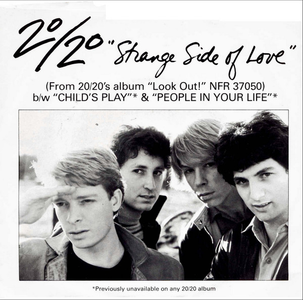

# Strange Side Of Love

By 20/20

## Album Data

[Discogs URL](https://www.discogs.com/release/4996057-2020-Strange-Side-Of-Love)

- Label: Portrait
- Formats: Vinyl, 7"
- Genres: Rock, Power Pop
- Rating: 4.25
- Released: 1981
- Year: 1981
- Release ID: 4996057
- Media condition: 
- Sleeve condition: 
- Speed: 
- Weight: 
- Notes: 

## Album Tracks

| **Position** | **Title** | **Duration** |
|--------------|-----------|--------------|
| A | **Strange Side Of Love** | 2:57 |
| B1 | **Child's Play** | 2:09 |
| B2 | **People In Your Life** | 3:28 |

## Artist Roles

| **Name** | **Role** |
|----------|----------|
| **Ron Flynt** | Bass Guitar, Keyboards, Vocals |
| **Joel Turrisi** | Drums |
| **Chris Silagyi** | Guitar, Synthesizer, Piano, Vocals |
| **Steve Allen (11)** | Lead Guitar, Keyboards, Vocals |
| **Shelly Heber** | Management [Career Direction] |
| **Vision Management** | Management [Career Direction] |
| **Richard Podolor** | Producer |

