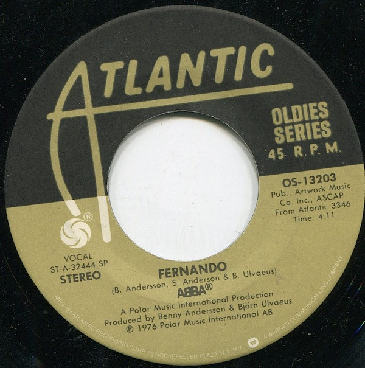

# Fernando / Dancing Queen

By ABBA

## Album Data

[Discogs URL](https://www.discogs.com/release/3721496-ABBA-Fernando-Dancing-Queen)

- Label: Atlantic
- Formats: Vinyl, 7", 45 RPM, Single
- Genres: Pop, Vocal
- Rating: 4.37
- Released: 1979
- Year: 1979
- Release ID: 3721496
- Media condition: 
- Sleeve condition: 
- Speed: 
- Weight: 
- Notes: 

## Album Tracks

| **Position** | **Title** | **Duration** |
|--------------|-----------|--------------|
| A | **Fernando** | 4:11 |
| AA | **Dancing Queen** | 3:50 |

## Artist Roles

| **Name** | **Role** |
|----------|----------|
| **George Piros** | Lacquer Cut By |
| **Benny Andersson** | Written-By |
| **Björn Ulvaeus** | Written-By |
| **Stig Anderson** | Written-By |

