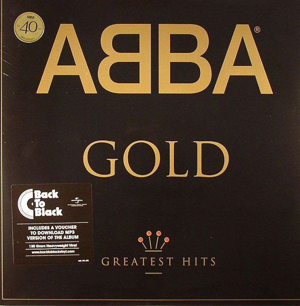

# Gold (Greatest Hits)

By ABBA

## Album Data

[Discogs URL](https://www.discogs.com/release/5896538-ABBA-Gold-Greatest-Hits)

- Label: Polar
Polydor
Polar
Polydor
- Formats: Vinyl, LP, Compilation, Reissue, Remastered
- Genres: Electronic, Pop, Europop, Disco
- Rating: 4.61
- Released: 2014-07-14
- Year: 1992
- Release ID: 5896538
- Media condition: 
- Sleeve condition: 
- Speed: 
- Weight: 
- Notes: 

## Album Tracks

| **Position** | **Title** | **Duration** |
|--------------|-----------|--------------|
| A1 | **Dancing Queen** | 3:49 |
| A2 | **Knowing Me, Knowing You** | 4:01 |
| A3 | **Take A Chance On Me** | 4:01 |
| A4 | **Mamma Mia** | 3:32 |
| A5 | **Lay All Your Love On Me** | 4:32 |
| B1 | **Super Trouper** | 4:10 |
| B2 | **I Have A Dream** | 4:43 |
| B3 | **The Winner Takes It All** | 4:54 |
| B4 | **Money, Money, Money** | 3:05 |
| B5 | **S.O.S.** | 3:19 |
| C1 | **Chiquitita** | 5:26 |
| C2 | **Fernando** | 4:10 |
| C3 | **Voulez Vous** | 5:05 |
| C4 | **Gimme! Gimme! Gimme! (A Man After Midnight)** | 4:46 |
| D1 | **Does Your Mother Know** | 3:14 |
| D2 | **One Of Us** | 3:53 |
| D3 | **The Name Of The Game** | 4:50 |
| D4 | **Thank You For The Music** | 3:51 |
| D5 | **Waterloo** | 2:42 |

## Artist Roles

| **Name** | **Role** |
|----------|----------|
| **Chris Griffin (4)** | Compiled By |
| **George McManus** | Compiled By [Assistant] |
| **Ingemar Bergman** | Compiled By [Assistant] |
| **Jackie Stansfield** | Compiled By [Assistant] |
| **John Tobler** | Compiled By [Assistant] |
| **John Waller** | Compiled By [Assistant] |
| **Icon (21)** | Design |
| **John Tobler** | Liner Notes |
| **Björn Ulvaeus & Benny Andersson** | Producer |
| **Michael B. Tretow** | Remastered By [Digitally] |
| **Björn Ulvaeus & Benny Andersson** | Written-By |

