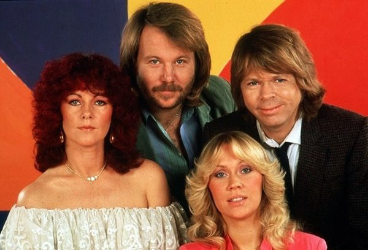

# ABBA

## Artist Profile

Swedish pop group ABBA, founded in 1972, became famous when they won the Eurovision Song Contest in 1974. It started a decade of almost uninterrupted string of hits and major selling albums.
After the group stopped releasing new material in 1982 (they never officially disbanded) there was a relative lull in their popularity – which came to an end in 1992 when "Gold (Greatest Hits)" was released. The compilation has become one of the world's most best-selling albums of all time.
In 1999, a musical based on ABBA hits called 'Mamma Mia!' opened in London. With various international productions, in 50 countries in all 6 continents, it is one of the most popular musicals of all time.
ABBA were inducted into the Rock & Roll Hall of Fame in 2010, in the category of 'Performers'.
ABBA released a new album in November 2021. Live shows with ABBA appearing as virtual 'abbatars' started in London in May 2022.

Agnetha Fältskog (born April 5th, 1950): vocals
Björn Ulvaeus (born April 25th, 1945): guitars, vocals
Benny Andersson (born December 16th, 1946): keyboards, vocals
Anni-Frid Lyngstad (born November 15th, 1945): vocals

## Artist Links

- [https://abbasite.com/](https://abbasite.com/)
- [https://abbavoyage.com/](https://abbavoyage.com/)
- [https://www.facebook.com/ABBA/](https://www.facebook.com/ABBA/)
- [https://www.youtube.com/user/abba](https://www.youtube.com/user/abba)
- [https://www.youtube.com/user/AbbaVEVO](https://www.youtube.com/user/AbbaVEVO)
- [https://soundcloud.com/abba-official](https://soundcloud.com/abba-official)
- [https://open.spotify.com/artist/0LcJLqbBmaGUft1e9Mm8HV](https://open.spotify.com/artist/0LcJLqbBmaGUft1e9Mm8HV)
- [https://abbathemuseum.com/](https://abbathemuseum.com/)
- [https://en.wikipedia.org/wiki/ABBA](https://en.wikipedia.org/wiki/ABBA)
- [http://www.abbaomnibus.net/](http://www.abbaomnibus.net/)
- [http://www.abbatalk.com/](http://www.abbatalk.com/)
- [http://abbarecordreviews.blogspot.com/](http://abbarecordreviews.blogspot.com/)
- [https://abbaoncd.wordpress.com/](https://abbaoncd.wordpress.com/)
- [https://www.thorsven.net/](https://www.thorsven.net/)
- [http://www.abbainfo.se/](http://www.abbainfo.se/)
- [https://felpin80.tripod.com/ata/](https://felpin80.tripod.com/ata/)

## See also

- [Fernando / Dancing Queen](Fernando_-_Dancing_Queen.md)
- [Gold (Greatest Hits)](Gold_Greatest_Hits.md)
- [Super Trouper](Super_Trouper.md)
