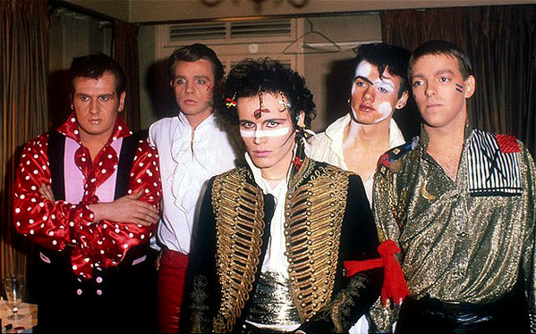

# Adam And The Ants

## Artist Profile

Adam and the Ants (sometimes stylized with a backwards "D" in "ADAM" & a "hard", zig-zagged "S" in "ANTS" - making it appear as a backwards "Z") were an English new wave band active during the late 1970s and early 1980s. The group, which lasted from 1977 to 1982, existed in two incarnations, both fronted by Adam Ant. The first, founded in May 1977, achieved considerable cult popularity during the transition from the punk rock era to the post-punk and new wave era and were noted for their high camp and overtly sexualised stage performances and songs. The final lineup of this first incarnation – Dave Barbarossa, Matthew Ashman and Leigh Gorman – left the band in January 1980 at the suggestion of then-de facto manager Malcolm McLaren, to form the instrumentalist personnel of the controversial Bow Wow Wow.

The second incarnation of Adam and the Ants featured guitarist Marco Pirroni and drummer-producer Chris Hughes and was noted for its use of Burundi style drumming. It lasted from February 1980 to March 1982 and achieved major commercial success in the UK and abroad.

Marco continued to collaborate with Adam throughout his solo career, until shorty after his comeback in 2010.

## Artist Links

- [http://www.adam-ant.net/](http://www.adam-ant.net/)
- [https://en.wikipedia.org/wiki/Adam_and_the_Ants](https://en.wikipedia.org/wiki/Adam_and_the_Ants)

## See also

- [Kings Of The Wild Frontier](Kings_Of_The_Wild_Frontier.md)
