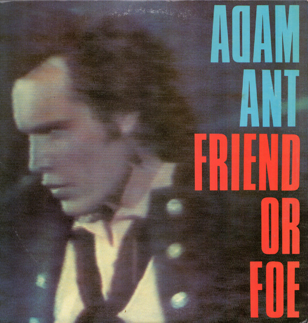

# Friend Or Foe

By Adam Ant

## Album Data

[Discogs URL](https://www.discogs.com/release/9451253-Adam-Ant-Friend-Or-Foe)

- Label: Epic
- Formats: Vinyl, LP, Album, Stereo
- Genres: Rock, Pop, New Wave, Pop Rock
- Rating: 3.9
- Released: 1982
- Year: 1982
- Release ID: 9451253
- Media condition: 
- Sleeve condition: 
- Speed: 
- Weight: 
- Notes: 

## Album Tracks

| **Position** | **Title** | **Duration** |
|--------------|-----------|--------------|
| A1 | **Friend Or Foe** | 3:21 |
| A2 | **Something Girls** | 2:53 |
| A3 | **Place In The Country** | 2:47 |
| A4 | **Desperate But Not Serious** | 4:10 |
| A5 | **Here Comes The Grump** | 3:31 |
| A6 | **Hello I Love You** | 2:38 |
| B1 | **Goody Two Shoes** | 3:27 |
| B2 | **Crackpot History And The Right To Lie** | 2:44 |
| B3 | **Made Of Money** | 3:24 |
| B4 | **Cajun Twisters** | 2:54 |
| B5 | **Try This For Sighs** | 3:01 |
| B6 | **Man Called Marco** | 3:25 |

## Artist Roles

| **Name** | **Role** |
|----------|----------|
| **Adam Ant** | Acoustic Guitar |
| **Adam Ant** | Arranged By [Bass Arrangements] |
| **Marco Pirroni** | Arranged By [Bass Arrangements] |
| **Adam Ant** | Backing Vocals |
| **Sam Brown** | Backing Vocals |
| **Sonia Jones** | Backing Vocals |
| **Vicki Brown** | Backing Vocals |
| **Adam Ant** | Bass |
| **Marco Pirroni** | Bass |
| **Marco Pirroni** | Castanets |
| **Stuart Monks** | Crew [Guitars And Equipment], Photography By [Liner] |
| **Jules Halfant** | Design [Graphic] |
| **Bogdan Wiczling** | Drums |
| **Alan Douglas (2)** | Engineer |
| **Martin Drover** | Flugelhorn |
| **Marco Pirroni** | Guitar |
| **Ray Janos** | Lacquer Cut By [Runout Etch √ANOS] |
| **Adam Ant** | Marimba |
| **Adam Ant** | Percussion |
| **Marco Pirroni** | Percussion |
| **Adam Ant** | Percussion [Sticks] |
| **Bogdan Wiczling** | Percussion [Sticks] |
| **Allan Ballard** | Photography By [Cover, Liner Photography] |
| **Adam Ant** | Producer, Design [Cover], Written-By |
| **Marco Pirroni** | Producer, Written-By |
| **Jeff Daly** | Saxophone |
| **Gavin MacKillop** | Tape Op [Tape Operator] |
| **George Chambers** | Tape Op [Tape Operator] |
| **Adam Ant** | Triangle |
| **Martin Drover** | Trumpet |
| **Adam Ant** | Violin [Attempted] |
| **Adam Ant** | Vocals |
| **Jude Kelly** | Vocals |
| **Marco Pirroni** | Vocals |

