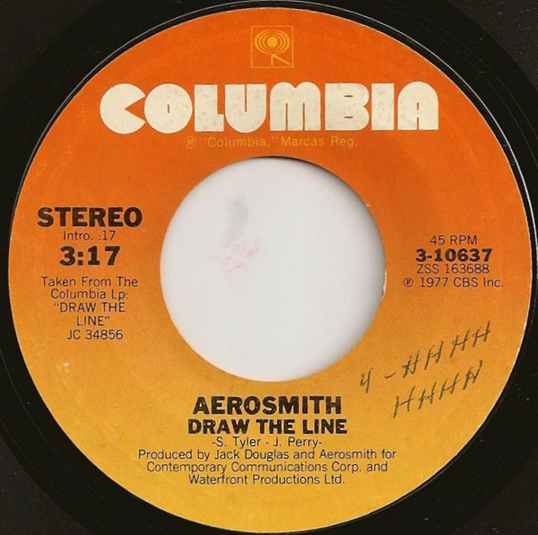

# Draw The Line

By Aerosmith

## Album Data

[Discogs URL](https://www.discogs.com/release/3825592-Aerosmith-Draw-The-Line)

- Label: Columbia
- Formats: Vinyl, 7", 45 RPM, Single, Styrene
- Genres: Rock, Classic Rock
- Rating: 4.18
- Released: 1977
- Year: 1977
- Release ID: 3825592
- Media condition: 
- Sleeve condition: 
- Speed: 
- Weight: 
- Notes: 

## Album Tracks

| **Position** | **Title** | **Duration** |
|--------------|-----------|--------------|
| A | **Draw The Line (Intro. :17)** | 3:17 |
| B | **Bright, Light, Fright (Intro. :20)** | 2:17 |

## Artist Roles

| **Name** | **Role** |
|----------|----------|
| **Aerosmith** | Producer |
| **Jack Douglas** | Producer |

