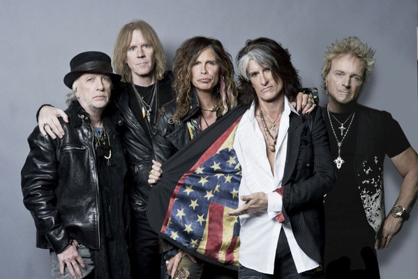

# Aerosmith

## Artist Profile

Aerosmith is an American rock band, sometimes referred to as "the Bad Boys from Boston" and "America's Greatest Rock and Roll Band". Their style, which is rooted in blues-based hard rock, has come to also incorporate elements of pop rock, heavy metal, and rhythm and blues, and has inspired many subsequent rock artists. They were formed in Boston, Massachusetts in 1970. Guitarist Joe Perry and bassist Tom Hamilton, originally in a band together called the Jam Band, met up with vocalist Steven Tyler, drummer Joey Kramer, and guitarist Ray Tabano, and formed Aerosmith. In 1971, Tabano was replaced by Brad Whitford, and the band began developing a following in Boston.

## Artist Links

- [https://www.aerosmith.com/](https://www.aerosmith.com/)
- [https://myspace.com/aerosmith](https://myspace.com/aerosmith)
- [https://en.wikipedia.org/wiki/Aerosmith](https://en.wikipedia.org/wiki/Aerosmith)
- [https://www.facebook.com/aerosmith](https://www.facebook.com/aerosmith)
- [https://soundcloud.com/aerosmith](https://soundcloud.com/aerosmith)
- [https://www.instagram.com/aerosmith/](https://www.instagram.com/aerosmith/)
- [https://www.youtube.com/channel/UCBxdHQVOaZhUOIj_3gt2FYw](https://www.youtube.com/channel/UCBxdHQVOaZhUOIj_3gt2FYw)
- [https://twitter.com/aerosmith](https://twitter.com/aerosmith)
- [https://www.last.fm/fr/music/Aerosmith](https://www.last.fm/fr/music/Aerosmith)

## See also

- [Draw The Line](Draw_The_Line.md)
- [The Other Side](The_Other_Side.md)
