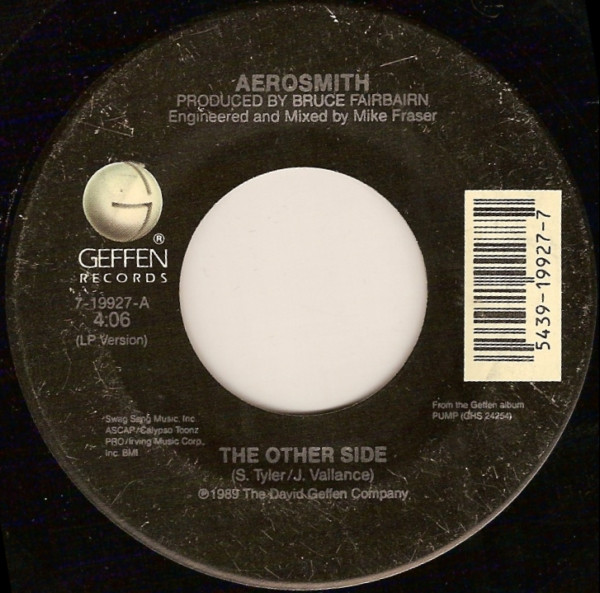

# The Other Side

By Aerosmith

## Album Data

[Discogs URL](https://www.discogs.com/release/2160252-Aerosmith-The-Other-Side)

- Label: Geffen Records
- Formats: Vinyl, 7", 45 RPM, Single
- Genres: Rock, Hard Rock
- Rating: 3.93
- Released: 1990
- Year: 1990
- Release ID: 2160252
- Media condition: 
- Sleeve condition: 
- Speed: 
- Weight: 
- Notes: 

## Album Tracks

| **Position** | **Title** | **Duration** |
|--------------|-----------|--------------|
| A | **The Other Side** | 4:06 |
| B | **My Girl** | 3:11 |

## Artist Roles

| **Name** | **Role** |
|----------|----------|
| **Mike Fraser** | Engineer, Mixed By |
| **Bruce Fairbairn** | Producer |
| **Jim Vallance** | Written-By |
| **Joe Perry** | Written-By |
| **Steven Tyler** | Written-By |

