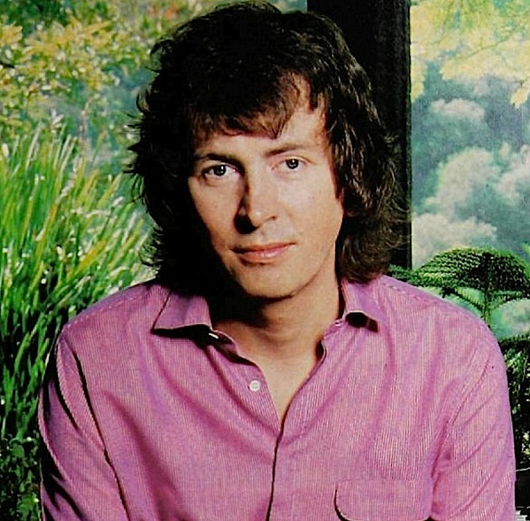

# Al Stewart

## Artist Profile

Scottish singer-songwriter best known for his song, "Year Of The Cat".

Born: 5th September 1945, in Greenock, Renfrewshire, Scotland.

## Artist Links

- [https://alstewart.com/](https://alstewart.com/)
- [http://amiright.com/artists/alstewart.shtml](http://amiright.com/artists/alstewart.shtml)
- [https://www.billboard.com/artist/al-stewart/](https://www.billboard.com/artist/al-stewart/)
- [https://genius.com/artists/Al-stewart](https://genius.com/artists/Al-stewart)
- [https://www.last.fm/music/Al+Stewart](https://www.last.fm/music/Al+Stewart)
- [https://musicvf.com/Al+Stewart.art](https://musicvf.com/Al+Stewart.art)
- [https://en.wikipedia.org/wiki/Al_Stewart](https://en.wikipedia.org/wiki/Al_Stewart)
- [https://bournemouthbeatboom.wordpress.com/al-stewart-3/](https://bournemouthbeatboom.wordpress.com/al-stewart-3/)

## See also

- [Year Of The Cat](Year_Of_The_Cat.md)
