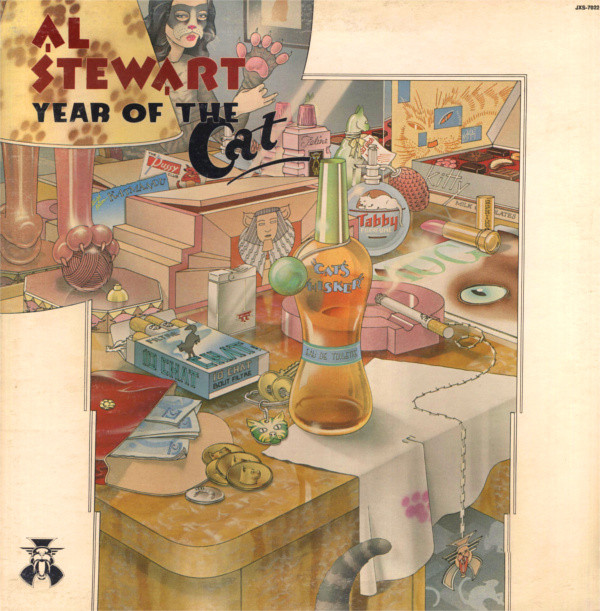

# Year Of The Cat

By Al Stewart

## Album Data

[Discogs URL](https://www.discogs.com/release/1074523-Al-Stewart-Year-Of-The-Cat)

- Label: Janus Records
- Formats: Vinyl, LP, Album
- Genres: Rock, Pop Rock
- Rating: 3.86
- Released: 1976
- Year: 1976
- Release ID: 1074523
- Media condition: 
- Sleeve condition: 
- Speed: 
- Weight: 
- Notes: 

## Album Tracks

| **Position** | **Title** | **Duration** |
|--------------|-----------|--------------|
| A1 | **Lord Grenville** | 5:00 |
| A2 | **On The Border** | 3:22 |
| A3 | **Midas Shadow** | 3:08 |
| A4 | **Sand In Your Shoes** | 3:02 |
| A5 | **If It Doesn't Come Naturally, Leave It** | 4:28 |
| B1 | **Flying Sorcery** | 4:20 |
| B2 | **Broadway Hotel** | 3:55 |
| B3 | **One Stage Before** | 4:39 |
| B4 | **Year Of The Cat** | 6:40 |

## Artist Roles

| **Name** | **Role** |
|----------|----------|
| **Phil Kenzie** | Alto Saxophone [Alto Sax] |
| **Andrew Powell** | Arranged By [String Arrangements] |
| **David Pack** | Backing Vocals |
| **John Perry (7)** | Backing Vocals |
| **Stuart Calver** | Backing Vocals |
| **Tony Rivers** | Backing Vocals |
| **George Ford** | Bass |
| **Colin Elgie** | Design [Sleeve] |
| **Hipgnosis (2)** | Design [Sleeve] |
| **Luke O'Reilly (2)** | Directed By |
| **Stuart Elliott** | Drums, Percussion |
| **Al Stewart** | Guitar |
| **Peter White** | Guitar |
| **Tim Renwick** | Guitar |
| **Graham Smith** | Harmonica |
| **Al Stewart** | Keyboards |
| **Don Lobster** | Keyboards |
| **Peter Wood (2)** | Keyboards |
| **Rob Brimson** | Photography By [Back Cover] |
| **Alan Parsons** | Producer |
| **Marion Driscoll** | Triangle |
| **Bobby Bruce** | Violin |
| **Al Stewart** | Written-By |

