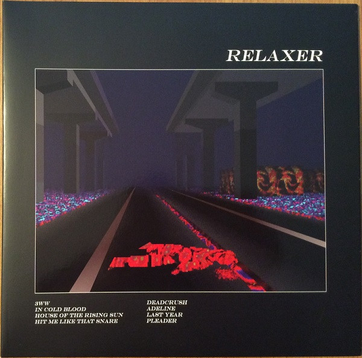

# Relaxer

By Alt-J

## Album Data

[Discogs URL](https://www.discogs.com/release/10382177-Alt-J-Relaxer)

- Label: Atlantic
Canvasback
Infectious Music
- Formats: Vinyl, LP, Album
- Genres: Rock, Experimental, Indie Rock
- Rating: 4.11
- Released: 2017-06-02
- Year: 2017
- Release ID: 10382177
- Media condition: 
- Sleeve condition: 
- Speed: 
- Weight: 
- Notes: 

## Album Tracks

| **Position** | **Title** | **Duration** |
|--------------|-----------|--------------|
| A1 | **3WW** | 5:00 |
| A2 | **In Cold Blood** | 3:26 |
| A3 | **House Of The Rising Sun** | 5:20 |
| A4 | **Hit Me Like That Snare** | 3:37 |
| B1 | **Deadcrush** | 3:51 |
| B2 | **Adeline** | 5:50 |
| B3 | **Last Year** | 6:06 |
| B4 | **Pleader** | 5:48 |

## Artist Roles

| **Name** | **Role** |
|----------|----------|
| **Osamu Sato** | Cover [Front And Back Cover Image] |
| **Heino Leja** | Lacquer Cut By |
| **KR (3)** | Lacquer Cut By |
| **Charlie Andrew** | Producer |
| **Ellie Rowsell** | Vocals [Additional Vocals] |
| **Marika Hackman** | Vocals [Additional Vocals] |

