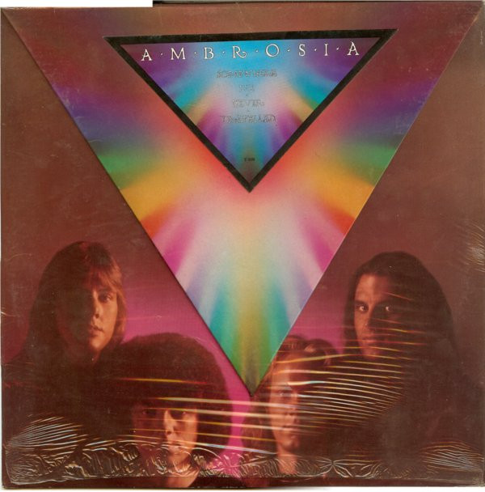

# Somewhere I've Never Travelled

By Ambrosia

## Album Data

[Discogs URL](https://www.discogs.com/release/1581591-Ambrosia-Somewhere-Ive-Never-Travelled)

- Label: 20th Century Records
- Formats: Vinyl, LP, Album
- Genres: Rock, Pop, Pop Rock, Prog Rock, Symphonic Rock
- Rating: 3.9
- Released: 1976
- Year: 1976
- Release ID: 1581591
- Media condition: 
- Sleeve condition: 
- Speed: 
- Weight: 
- Notes: 

## Album Tracks

| **Position** | **Title** | **Duration** |
|--------------|-----------|--------------|
| A1 | **And...** | 0:47 |
| A2 | **Somewhere I've Never Travelled** | 4:09 |
| A3 | **Cowboy Star** | 6:20 |
| A4 | **Runnin' Away** | 3:27 |
| A5 | **Harvey** | 1:27 |
| A6 | **I Wanna Know** | 5:58 |
| B1 | **The Brunt** | 5:26 |
| B2 | **Danse With Me George (Chopin's Plea)** | 7:47 |
| B3 | **Can't Let A Woman** | 4:18 |
| B4 | **We Need You Too** | 5:31 |

## Artist Roles

| **Name** | **Role** |
|----------|----------|
| **Ambrosia (2)** | Arranged By |
| **David Larkham** | Art Direction |
| **Hogin McMurtrie** | Artwork [Pyramid Art And Production, Calligraphy], Design |
| **Joe Puerta** | Bass, Synthesizer [Moog Pedals], Vocals |
| **Alfred Kwashie Ladzekpo** | Conductor [Cal Arts African Ensemble Directed By] |
| **Kobla Ladzekpo** | Conductor [Cal Arts African Ensemble Directed By] |
| **Burleigh Drummond** | Drums, Percussion, Bassoon |
| **Tom Trefethen** | Engineer [Additional] |
| **Freddie Piro** | Executive-Producer |
| **David Pack** | Guitar, Strings [String Ensemble], Vocals |
| **Christopher North** | Keyboards, Vocals |
| **Ruth Underwood** | Marimba |
| **Allen Zentz** | Mastered By |
| **Andrew Powell** | Orchestrated By |
| **CalArts African Ensemble** | Performer |
| **Ed Caraeff** | Photography By |
| **Alan Parsons** | Producer, Engineer |
| **Keith O. Johnson** | Recorded By [Special Effects] |
| **Ian Underwood** | Saxophone |
| **Daniel Kobialka** | Violin |

