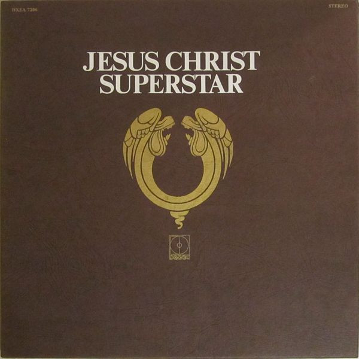

# Jesus Christ Superstar - A Rock Opera

By Andrew Lloyd Webber

## Album Data

[Discogs URL](https://www.discogs.com/release/3883400-Andrew-Lloyd-Webber-Tim-Rice-Jesus-Christ-Superstar-A-Rock-Opera)

- Label: Decca
- Formats: Vinyl
Box Set, LP, Album
- Genres: Rock, Stage & Screen, Classic Rock, Musical
- Rating: 4.13
- Released: 1970
- Year: 1970
- Release ID: 3883400
- Media condition: 
- Sleeve condition: 
- Speed: 
- Weight: 
- Notes: 

## Album Tracks

| **Position** | **Title** | **Duration** |
|--------------|-----------|--------------|
| A1 | **Overture** | 3:59 |
| A2 | **Heaven On Their Minds** | 4:23 |
| A3 | **What's The Buzz / Strange Thing Mystifying** | 4:13 |
| A4 | **Everything's Alright** | 5:15 |
| A5 | **This Jesus Must Die** | 3:36 |
| B1 | **Hosanna** | 2:07 |
| B2 | **Simon Zealotes / Poor Jerusalem** | 4:49 |
| B3 | **Pilate's Dream** | 1:28 |
| B4 | **The Temple** | 4:43 |
| B5 | **Everything's Alright** | 0:34 |
| B6 | **I Don't Know How To Love Him** | 3:36 |
| B7 | **Damned For All Time / Blood Money** | 5:11 |
| C1 | **The Last Supper** | 7:10 |
| C2 | **Gethsemane (I Only Want To Say)** | 5:33 |
| C3 | **The Arrest** | 3:24 |
| C4 | **Peter's Denial** | 1:27 |
| C5 | **Pilate And Christ** | 2:46 |
| C6 | **King Herod's Song (Try It And See)** | 3:02 |
| D1 | **Judas' Death** | 4:17 |
| D2 | **Trial Before Pilate (Including The 39 Lashes)** | 5:13 |
| D3 | **Superstar** | 4:16 |
| D4 | **Crucifixion** | 4:04 |
| D5 | **John Nineteen: Forty One** | 2:10 |

## Artist Roles

| **Name** | **Role** |
|----------|----------|
| **Henry McCullough** | Acoustic Guitar |
| **Bill Levy** | Art Direction |
| **Alan Spenner** | Bass |
| **Alan Weighall** | Bass Guitar |
| **Jeff Clyne** | Bass Guitar |
| **Peter Morgan (2)** | Bass Guitar |
| **Anthony Brooke** | Bassoon |
| **Joseph Castaldini** | Bassoon |
| **Ian Herbert** | Clarinet |
| **Andrew Lloyd Webber** | Composed By, Arranged By [Orchestration], Music Director [Musical Direction] |
| **Ernie Cefalu** | Design |
| **Mike Vickers** | Directed By [Moog Synthesizer] |
| **John Marshall** | Drums |
| **Bruce Rowland** | Drums, Percussion |
| **Henry McCullough** | Electric Guitar |
| **Neil Hubbard** | Electric Guitar |
| **Martin Rushent** | Engineer [Advision] |
| **Alan O'Duffy** | Engineer [Chief Recording] |
| **Tony Bridge** | Engineer [Cutting] |
| **Anton Matthews** | Engineer [Recording] |
| **Jeremy Gee** | Engineer [Recording] |
| **Steve Vaughan** | Engineer [Recording] |
| **Brian Warren** | Flute |
| **Chris Taylor (5)** | Flute |
| **Chris Spedding** | Guitar |
| **Clive Hicks** | Guitar |
| **Louis Stewart** | Guitar |
| **Steve Vaughan** | Guitar |
| **Andrew McGavin** | Horns |
| **Douglas Moore (3)** | Horns |
| **James W. Brown (2)** | Horns |
| **Jim Buck Jr** | Horns |
| **Jim Buck Sr** | Horns |
| **John Burden** | Horns |
| **Tim Rice** | Lyrics By |
| **Don Norman** | Management [Production] |
| **Bill Le Sage** | Percussion |
| **Karl Jenkins** | Piano |
| **Norman Cave** | Piano |
| **Peter Robinson** | Piano, Electric Piano, Organ, Organ [Positive] |
| **Mick Weaver** | Piano, Organ |
| **Andrew Lloyd Webber** | Piano, Organ, Synthesizer [Moog] |
| **Andrew Lloyd Webber** | Producer |
| **Tim Rice** | Producer |
| **City Of London Ensemble** | Strings |
| **Alan Doggett** | Synthesizer [Moog], Conductor [Principal Orchestra] |
| **Chris Mercer** | Tenor Saxophone |
| **Anthony Moore (7)** | Trombone |
| **Frank Jones (12)** | Trombone |
| **Keith Christie** | Trombone |
| **Harry Beckett** | Trumpet |
| **Ian Hamer** | Trumpet |
| **Kenny Wheeler** | Trumpet |
| **Les Condon** | Trumpet |
| **Brian Keith (2)** | Vocals [Annas] |
| **Victor Brox** | Vocals [Caiaphas, High Priest] |
| **Ian Gillan** | Vocals [Jesus Christ] |
| **Murray Head** | Vocals [Judas Iscariot] |
| **Mike D'Abo** | Vocals [King Herod] |
| **Annette Brox** | Vocals [Maid By The Fire] |
| **Yvonne Elliman** | Vocals [Mary Magdalene] |
| **Paul Davis (11)** | Vocals [Peter] |
| **Barry Dennen** | Vocals [Pontius Pilate] |
| **Paul Raven (2)** | Vocals [Priest] |
| **John Gustafson** | Vocals [Simon Zealotes] |

