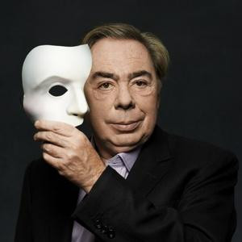

# Andrew Lloyd Webber

## Artist Profile

British composer and impresario of musical theatre and TV personality, born 22 March 1948 in London, England, UK.

Formally he is known as "Sir Andrew Lloyd Webber, Baron Lloyd-Webber Of Sydmonton", after being knighted by The Queen in 1992, and being made a life peer in 1997, sitting as a Conservative member of the House Of Lords.

## Artist Links

- [https://www.andrewlloydwebber.com/](https://www.andrewlloydwebber.com/)
- [https://www.facebook.com/AndrewLloydWebber/](https://www.facebook.com/AndrewLloydWebber/)
- [https://twitter.com/officialalw](https://twitter.com/officialalw)
- [https://www.youtube.com/andrewlloydwebbermusicals/](https://www.youtube.com/andrewlloydwebbermusicals/)
- [https://www.instagram.com/andrewlloydwebber/](https://www.instagram.com/andrewlloydwebber/)
- [https://en.wikipedia.org/wiki/Andrew_Lloyd_Webber](https://en.wikipedia.org/wiki/Andrew_Lloyd_Webber)
- [https://www.britannica.com/biography/Andrew-Lloyd-Webber-Baron-Lloyd-Webber-of-Sydmonton](https://www.britannica.com/biography/Andrew-Lloyd-Webber-Baron-Lloyd-Webber-of-Sydmonton)
- [https://www.imdb.com/name/nm0515908/](https://www.imdb.com/name/nm0515908/)

## See also

- [Jesus Christ Superstar - A Rock Opera](Jesus_Christ_Superstar_-_A_Rock_Opera.md)
