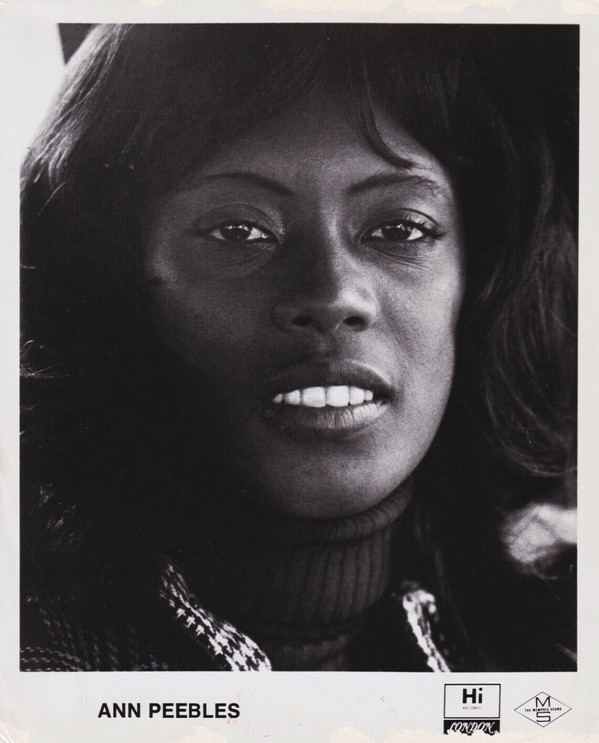

# Ann Peebles

## Artist Profile

American singer and song writer (born April 27, 1947 in East St. Louis, Illinois, U.S.A.), internationally acclaimed and best known for her popular Memphis soul albums of the 1970s on the Hi Records label. She soon began penning and singing hits for the label, co-writing with in-house composer & vocalist Don Bryant, whom she later married in 1974. Ann Peebles has been sampled by many Hip-Hop artists, including RZA, the Wu-Tang Clan and Missy Elliott.

## Artist Links

- [https://myspace.com/annpeebles](https://myspace.com/annpeebles)
- [https://en.wikipedia.org/wiki/Ann_Peebles](https://en.wikipedia.org/wiki/Ann_Peebles)
- [http://www.soulwalking.co.uk/Ann%20Peebles.html](http://www.soulwalking.co.uk/Ann%20Peebles.html)
- [https://www.whosampled.com/Ann-Peebles/sampled/](https://www.whosampled.com/Ann-Peebles/sampled/)
- [https://www.allmusic.com/artist/ann-peebles-mn0000921002](https://www.allmusic.com/artist/ann-peebles-mn0000921002)

## See also

- [If This Is Heaven](If_This_Is_Heaven.md)
