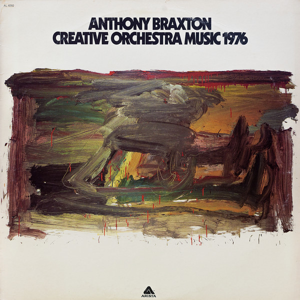

# Creative Orchestra Music 1976

By Anthony Braxton

## Album Data

[Discogs URL](https://www.discogs.com/release/9054908-Anthony-Braxton-Creative-Orchestra-Music-1976)

- Label: Arista
- Formats: Vinyl, LP, Album, Promo, Test Pressing
- Genres: Jazz, Free Jazz
- Rating: 4
- Released: 1976
- Year: 1976
- Release ID: 9054908
- Media condition: 
- Sleeve condition: 
- Speed: 
- Weight: 
- Notes: 

## Album Tracks

| **Position** | **Title** | **Duration** |
|--------------|-----------|--------------|
| A1 | **Cut One** | 5:10 |
| A2 | **Cut Two** | 7:36 |
| A3 | **Cut Three** | 6:43 |
| B1 | **Cut One** | 6:26 |
| B2 | **Cut Two** | 7:19 |
| B3 | **Cut Three** | 6:40 |

## Artist Roles

| **Name** | **Role** |
|----------|----------|
| **Anthony Braxton** | Alto Saxophone |
| **Roscoe Mitchell** | Alto Saxophone |
| **Seldon Powell** | Alto Saxophone |
| **Bruce Johnstone** | Baritone Saxophone |
| **Dave Holland** | Bass |
| **Bruce Johnstone** | Bass Clarinet |
| **Frederic Rzewski** | Bass Drum |
| **Roscoe Mitchell** | Bass Saxophone |
| **Earl McIntyre** | Bass Trombone |
| **Jack Jeffers** | Bass Trombone |
| **Barry Altschul** | Bells, Chimes [Orchestra] |
| **Dave Holland** | Cello |
| **Anthony Braxton** | Clarinet |
| **Ron Bridgewater** | Clarinet |
| **Seldon Powell** | Clarinet |
| **Muhal Richard Abrams** | Conductor |
| **Wadada Leo Smith** | Conductor |
| **Anthony Braxton** | Contrabass Clarinet |
| **Anthony Braxton** | Contrabass Saxophone |
| **Phillip Wilson** | Cymbal [Marching] |
| **Warren Smith** | Drums |
| **Anthony Braxton** | Flute |
| **Roscoe Mitchell** | Flute |
| **Seldon Powell** | Flute |
| **Karl Berger** | Glockenspiel |
| **Barry Altschul** | Gong |
| **Barry Altschul** | Percussion |
| **Phillip Wilson** | Percussion |
| **Phillip Wilson** | Percussion |
| **Frederic Rzewski** | Piano |
| **Muhal Richard Abrams** | Piano |
| **Jon Faddis** | Piccolo Trumpet |
| **Barry Altschul** | Snare |
| **Warren Smith** | Snare |
| **Anthony Braxton** | Sopranino Saxophone |
| **Roscoe Mitchell** | Soprano Saxophone |
| **Richard Teitelbaum** | Synthesizer |
| **Ron Bridgewater** | Tenor Saxophone |
| **Warren Smith** | Timpani, Bass Drum |
| **Garrett List** | Trombone |
| **George Lewis** | Trombone |
| **Cecil Bridgewater** | Trumpet |
| **Jon Faddis** | Trumpet |
| **Kenny Wheeler** | Trumpet |
| **Wadada Leo Smith** | Trumpet |
| **Jonathan Dorn** | Tuba |
| **Karl Berger** | Vibraphone |
| **Karl Berger** | Xylophone, Chimes [Orchestra] |

