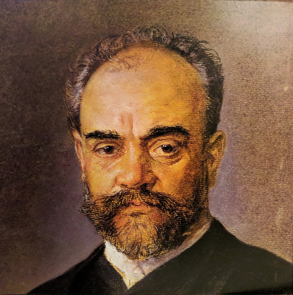

# Antonín Dvořák

## Artist Profile

Czech composer of romantic music (classicist-romantic synthesis).

Born September 8, 1841 in Nelahozeves, Czechia, died May 1, 1904 in Prague, Czechia. Father-in-law of Josef Suk (2). He employed the idioms of the folk music of Moravia and his native Bohemia. His works include symphonies, symphonic poems, concerti, choral works, operas and chamber music.

## Artist Links

- [http://www.antonin-dvorak.cz/](http://www.antonin-dvorak.cz/)
- [https://antonindvorak.cz/](https://antonindvorak.cz/)
- [https://en.wikipedia.org/wiki/Anton%C3%ADn_Dvo%C5%99%C3%A1k](https://en.wikipedia.org/wiki/Anton%C3%ADn_Dvo%C5%99%C3%A1k)
- [https://www.britannica.com/biography/Antonin-Dvorak](https://www.britannica.com/biography/Antonin-Dvorak)
- [https://www.famouscomposers.net/antonin-dvorak](https://www.famouscomposers.net/antonin-dvorak)
- [https://www.treccani.it/enciclopedia/antonin-dvorak](https://www.treccani.it/enciclopedia/antonin-dvorak)

## See also

- [Symphony No. 9 "New World" ● Overture "Othello](Symphony_No_9_New_World_●_Overture_Othello.md)
