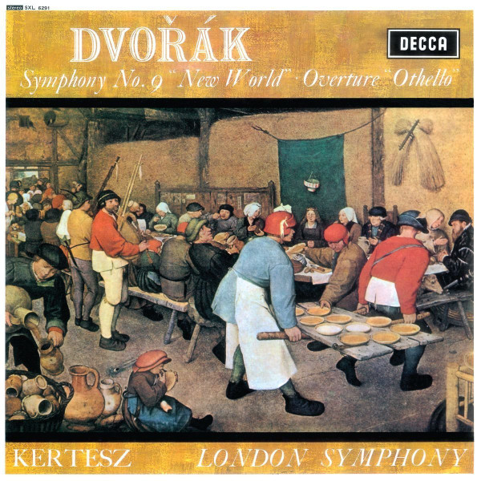

# Symphony No. 9 "New World" ● Overture "Othello"

By Antonín Dvořák

## Album Data

[Discogs URL](https://www.discogs.com/release/10033594-Dvo%C5%99%C3%A1k-Kertesz-London-Symphony-Symphony-No-9-New-World-Overture-Othello)

- Label: Decca
- Formats: Vinyl, LP, Stereo
- Genres: Classical, Romantic
- Rating: 4.5
- Released: 2016
- Year: 1967
- Release ID: 10033594
- Media condition: 
- Sleeve condition: 
- Speed: 
- Weight: 
- Notes: 

## Album Tracks

| **Position** | **Title** | **Duration** |
|--------------|-----------|--------------|
|  | **Symphony No. 9 In E Minor, Op. 95** |  |
| B2 | **"Othello" Overture, Op. 93** |  |

## Artist Roles

| **Name** | **Role** |
|----------|----------|
| **Antonín Dvořák** | Composed By |
| **István Kertész** | Conductor |
| **Pieter Bruegel the Elder** | Cover [Painting; Uncredited; <i>"The Peasant Wedding"</i>] |
| **The London Symphony Orchestra** | Orchestra |

