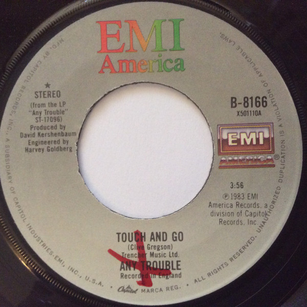

# Touch And Go

By Any Trouble

## Album Data

[Discogs URL](https://www.discogs.com/release/4564207-Any-Trouble-Touch-And-Go)

- Label: EMI America
- Formats: Vinyl, 7", 45 RPM, Single
- Genres: Funk / Soul, Pop, Soul
- Rating: 3
- Released: 1983
- Year: 1983
- Release ID: 4564207
- Media condition: 
- Sleeve condition: 
- Speed: 
- Weight: 
- Notes: 

## Album Tracks

| **Position** | **Title** | **Duration** |
|--------------|-----------|--------------|
| A | **Touch And Go** | 3:56 |
| B | **Man Of The Moment** | 3:52 |

## Artist Roles

| **Name** | **Role** |
|----------|----------|
| **Harvey Goldberg** | Engineer |
| **David Kershenbaum** | Producer |
| **Clive Gregson** | Written-By |

