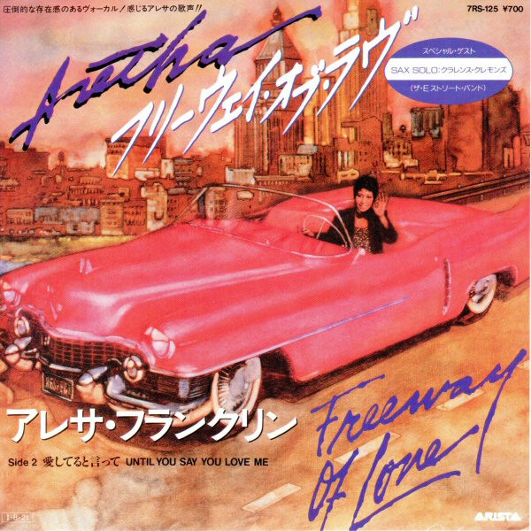

# Freeway Of Love

By Aretha Franklin

## Album Data

[Discogs URL](https://www.discogs.com/release/1842535-Aretha-Franklin-Freeway-Of-Love)

- Label: Arista
- Formats: Vinyl, 7", 45 RPM
- Genres: Funk / Soul, Rhythm & Blues, Soul, Funk, Disco
- Rating: 3.57
- Released: 1985
- Year: 1985
- Release ID: 1842535
- Media condition: 
- Sleeve condition: 
- Speed: 
- Weight: 
- Notes: 

## Album Tracks

| **Position** | **Title** | **Duration** |
|--------------|-----------|--------------|
| A | **Freeway Of Love** | 4:09 |
| B | **Until You Say You Love Me** | 4:55 |

## Artist Roles

| **Name** | **Role** |
|----------|----------|
| **Narada Michael Walden** | Producer, Arranged By |
| **Jeffrey Cohen** | Written-By |
| **Narada Michael Walden** | Written-By |
| **Preston Glass** | Written-By |

