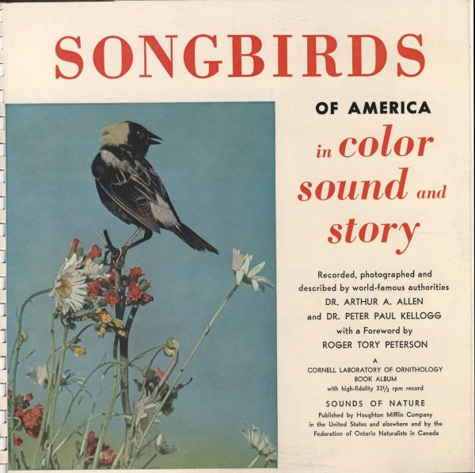

# Songbirds Of America

By Arthur A. Allen

## Album Data

[Discogs URL](https://www.discogs.com/release/4564324-Dr-Arthur-A-Allen-Dr-Peter-P-Kellogg-Songbirds-Of-America)

- Label: Cornell University Records
- Formats: Vinyl, LP, 10", Reissue
- Genres: Non-Music, Field Recording, Education
- Rating: 3.5
- Released: 1963
- Year: 1954
- Release ID: 4564324
- Media condition: 
- Sleeve condition: 
- Speed: 
- Weight: 
- Notes: 

## Album Tracks

| **Position** | **Title** | **Duration** |
|--------------|-----------|--------------|
| A1 | **Bluebird** |  |
| A2 | **Brown Thrasher** |  |
| A3 | **Chickadee** |  |
| A4 | **Carolina Wren** |  |
| A5 | **Red-Eyed Vireo** |  |
| A6 | **Warbling Vireo** |  |
| A7 | **Yellow Warbler** |  |
| A8 | **Robin** |  |
| A9 | **Goldfinch** |  |
| A10 | **Catbird** |  |
| A11 | **Red-Winged Blackbird** |  |
| A12 | **Rose-Breasted Grosbeak** |  |
| B1 | **Bobolink** |  |
| B2 | **Mockingbird** |  |
| B3 | **Meadowlark** |  |
| B4 | **Indigo Bunting** |  |
| B5 | **Baltimore Oriole** |  |
| B6 | **Wood Thrush** |  |
| B7 | **House Wren** |  |
| B8 | **Song Sparrow** |  |
| B9 | **Fox Sparrow** |  |
| B10 | **White-Throated Sparrow** |  |
| B11 | **Pewee** |  |
| B12 | **Cardinal** |  |

## Artist Roles

| **Name** | **Role** |
|----------|----------|
| **Nathan Resnick** | Design, Edited By |
| **Roger Tory Peterson** | Liner Notes |
| **Arthur A. Allen** | Recorded By |
| **Peter Paul Kellogg** | Recorded By, Engineer |

