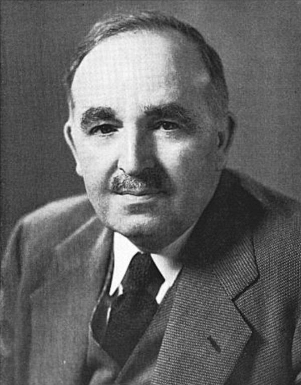

# Arthur A. Allen

## Artist Profile

Arthur Augustus "Doc" Allen, Ph.D. (b. December 28, 1885 d. January 17, 1964) Ornithologist and founder of the Laboratory of Ornithology at Cornell University. Was married to Elsa Guerdrum, Pd.D., another prominent ornithologist.

## Artist Links

- [http://www.scricciolo.com/in.memoriam.A.A.Allen.pdf](http://www.scricciolo.com/in.memoriam.A.A.Allen.pdf)

## See also

- [Songbirds Of America](Songbirds_Of_America.md)
