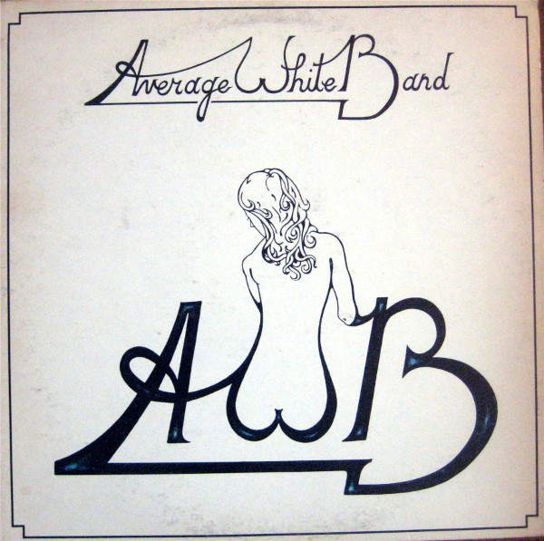

# AWB

By Average White Band

## Album Data

[Discogs URL](https://www.discogs.com/release/455128-Average-White-Band-AWB)

- Label: Atlantic
- Formats: Vinyl, LP, Album
- Genres: Funk / Soul, Funk
- Rating: 3.93
- Released: 1974
- Year: 1974
- Release ID: 455128
- Media condition: 
- Sleeve condition: 
- Speed: 
- Weight: 
- Notes: 

## Album Tracks

| **Position** | **Title** | **Duration** |
|--------------|-----------|--------------|
| A1 | **You Got It** | 3:38 |
| A2 | **Got The Love** | 3:52 |
| A3 | **Pick Up The Pieces** | 3:58 |
| A4 | **Person To Person** | 3:38 |
| A5 | **Work To Do** | 4:21 |
| B1 | **Nothing You Can Do** | 4:06 |
| B2 | **Just Wanna Love You Tonight** | 3:57 |
| B3 | **Keepin' It To Myself** | 3:52 |
| B4 | **I Just Can't Give You Up** | 3:24 |
| B5 | **There's Always Someone Waiting** | 5:38 |

## Artist Roles

| **Name** | **Role** |
|----------|----------|
| **Average White Band** | Arranged By |
| **Roger Ball** | Arranged By [Horns] |
| **Alan Gorrie** | Backing Vocals |
| **Hamish Stuart** | Backing Vocals |
| **Onnie McIntyre** | Backing Vocals, Guitar |
| **Alan Gorrie** | Bass |
| **Ralph MacDonald** | Congas, Percussion [Additional] |
| **Barry Feinstein** | Design, Photography By |
| **Camouflage Productions** | Design, Photography By [For] |
| **Robbie McIntosh (2)** | Drums, Percussion |
| **Gene Paul** | Engineer |
| **Howard Albert** | Engineer |
| **Karl Richardson** | Engineer |
| **Lew Hahn** | Engineer |
| **Ron Albert** | Engineer |
| **Steve Klein** | Engineer |
| **Bobby Warner** | Engineer [Additional Recording] |
| **Jimmy Douglass** | Engineer [Additional Recording] |
| **Hamish Stuart** | Guitar [Solo], Soloist |
| **Onnie McIntyre** | Guitar [Solo], Soloist |
| **Tim Bruckner** | Illustration [Front Cover] |
| **Roger Ball** | Keyboards, Arranged By [Horns], Alto Saxophone, Baritone Saxophone |
| **Hamish Stuart** | Lead Guitar |
| **Hamish Stuart** | Lead Vocals |
| **Alan Gorrie** | Lead Vocals, Design Concept [Logo Concept] |
| **Dennis King** | Mastered By |
| **Arif Mardin** | Mixed By [Re-mixed By] |
| **Gene Paul** | Mixed By [Re-mixed By] |
| **Arif Mardin** | Producer |
| **Malcolm Duncan** | Tenor Saxophone |
| **Michael Brecker** | Tenor Saxophone |
| **Glenn Ferris** | Trombone |
| **Marvin Stamm** | Trumpet |
| **Mel Davis** | Trumpet |
| **Randy Brecker** | Trumpet |

