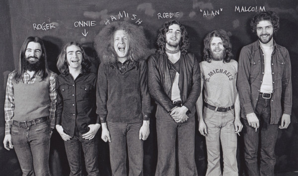

# Average White Band

## Artist Profile

Original Members:
Alan Gorrie (b. 19th July 1946, Perth, Scotland; bass, vocals); Mike Rosen (trumpet, guitar); replaced by Hamish Stuart (b. 8th October 1949, Glasgow, Scotland; guitar, vocals); Owen 'Onnie' McIntyre (b. 25th September 1945, Lennoxtown, Scotland; guitar); Malcolm 'Mollie' Duncan (b. 24th August 1945, Montrose, Scotland; saxophone); Roger Ball (b. 4th June 1944, Broughty Ferry, Scotland; saxophone, keyboards); Robbie McIntosh (b. 6th May 1950, Dundee, Scotland, d. 23 September 1974, Hollywood, U.S.A; drums).

History:
This unique act, an R'n'B/ soul group from Scotland and originally with no black musicians became one of the best selling and sounding funk bands in the world. The horn section started out as "The Dundee Horns". They can be heard on Johnny Nash's reggae hit "I Can See Clearly Now".
Eric Clapton and Bonnie Bramlett (of Delaney & Bonnie) helped them on their way to becoming a household name. But it wasn't until they reached the US and were signed to Atlantic Records that the Average White Band really took off (Jerry Wexler signed them on the spot, after they hit him at home on one of his parties, where they played him the basic tracks for what would become the White Album: "AWB").
Arif Mardin became their producer and together they couldn't do wrong. All of their seventies albums reached gold or even platinum status and hits such as the timeless "Pick Up The Pieces" and "Cut The Cake" were number 1 hits on the U.S. Billboard Charts. 
Tragedy hit the young group in 1974 when their drummer, Robbie McIntosh died at a Hollywood party in a drug-related incident, but their act only became stronger. It was after Robbie's death, Steve Ferrone joined to replace Robbie on drums, and was the only black musician in band, it was a standing joke in the band that they 'played' with the press because of their band name.
The Double album "Person To Person", recorded during their American 1975 Tour, is among the best selling live funk albums ever.
They reached the white market with their unique sound without losing respect from the core Soul/ R'n'B lover in the black communities.

## Artist Links

- [http://www.averagewhiteband.com/](http://www.averagewhiteband.com/)
- [http://en.wikipedia.org/wiki/Average_White_Band](http://en.wikipedia.org/wiki/Average_White_Band)
- [https://www.imdb.com/name/nm2197207/](https://www.imdb.com/name/nm2197207/)

## See also

- [AWB](AWB.md)
