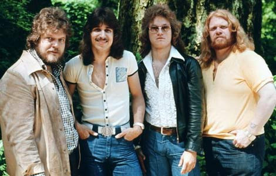

# Bachman-Turner Overdrive

## Artist Profile

Canadian rock band from Winnipeg, Manitoba, active 1973–1979, 1983–2005. Lineups without Randy Bachman were typically known as simply B.T.O. or BTO. Randy Bachman & C.F. Turner reunited as Bachman &amp; Turner 2009-2018.

Founded as Brave Belt in 1971 by Randy Bachman with his former bandmate Chad Allen and Randy's brother Rob Bachman on drums. C.F. Turner joined on bass & vocals later that year, after the first album. Allen left in 1972, after the second album, and third Bachman brother Tim Bachman joined on guitar. Their third record was released in 1973 with the new band name Bachman-Turner Overdrive. Tim Bachman was replaced with Blair Thornton in 1974. Randy Bachman left in 1977 and Jim Clench joined. 

The band broke up in 1979, but reunited in 1983 and was active, with various lineups, until 2005.

Members inducted into the Canadian Music Hall of Fame in 2014:

Randy Bachman (Guitar and vocals)
Blair Thornton (Guitar)
C. F. (Fred) Turner (Bass and vocals)
Robbie (Robin) Bachman (Drums)

## Artist Links

- [https://en.wikipedia.org/wiki/Bachman%E2%80%93Turner_Overdrive](https://en.wikipedia.org/wiki/Bachman%E2%80%93Turner_Overdrive)
- [https://www.facebook.com/ROBBIEBACHMANTURNEROVERDRIVE/](https://www.facebook.com/ROBBIEBACHMANTURNEROVERDRIVE/)
- [https://www.facebook.com/pages/Bachman-Turner-Overdrive/324067263169](https://www.facebook.com/pages/Bachman-Turner-Overdrive/324067263169)
- [https://www.facebook.com/groups/btobravebelt/](https://www.facebook.com/groups/btobravebelt/)
- [http://www.canadianbands.com/BTO.html](http://www.canadianbands.com/BTO.html)
- [https://www.loudersound.com/features/the-turbulent-history-of-bachman-turner-overdrive](https://www.loudersound.com/features/the-turbulent-history-of-bachman-turner-overdrive)
- [https://web.archive.org/web/20021106213706/http://classicwebs.com/bto.htm](https://web.archive.org/web/20021106213706/http://classicwebs.com/bto.htm)
- [https://musicianbio.org/bachman-turner-overdrive/](https://musicianbio.org/bachman-turner-overdrive/)
- [https://www.musicianguide.com/biographies/1608004202/Bachman-Turner-Overdrive.html](https://www.musicianguide.com/biographies/1608004202/Bachman-Turner-Overdrive.html)
- [https://www.allpar.com/ed/btohist.html](https://www.allpar.com/ed/btohist.html)
- [https://www.youtube.com/channel/UC5mrFYxM2gUV8zkM-kh4rJg](https://www.youtube.com/channel/UC5mrFYxM2gUV8zkM-kh4rJg)
- [http://www.last.fm/music/Bachman-Turner+Overdrive](http://www.last.fm/music/Bachman-Turner+Overdrive)
- [https://www.thecanadianencyclopedia.ca/en/article/bachman-turner-overdrive-emc](https://www.thecanadianencyclopedia.ca/en/article/bachman-turner-overdrive-emc)
- [https://www.imdb.com/name/nm1948948/](https://www.imdb.com/name/nm1948948/)

## See also

- [Bachman-Turner Overdrive II](Bachman-Turner_Overdrive_II.md)
- [Not Fragile](Not_Fragile.md)
